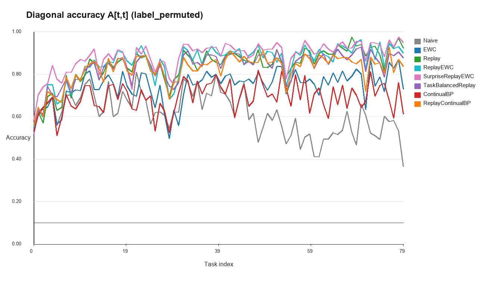
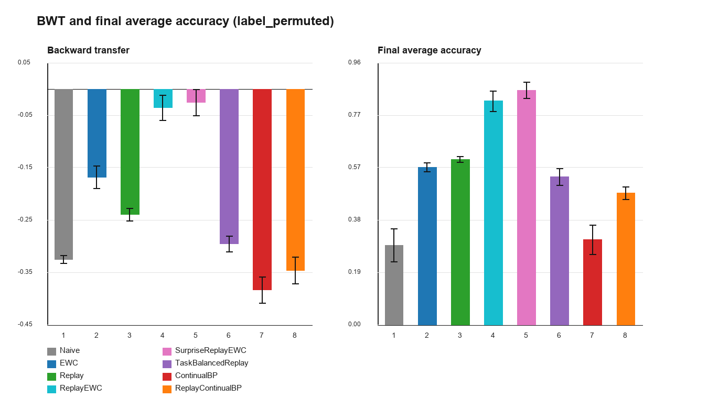
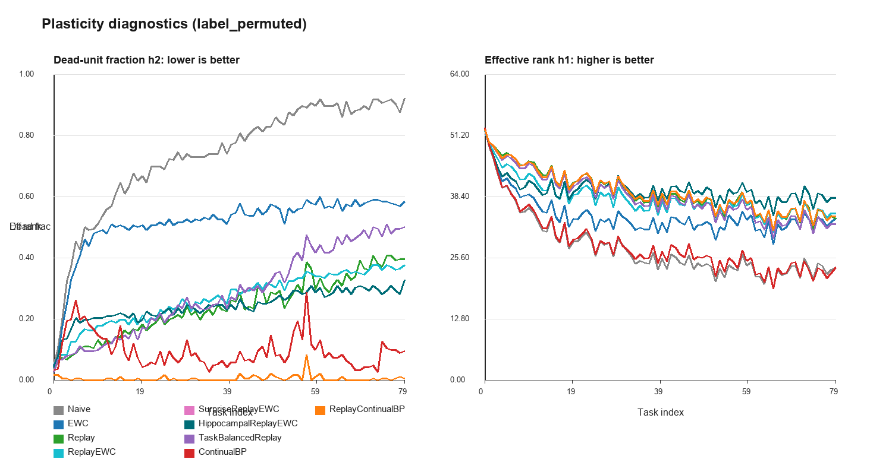
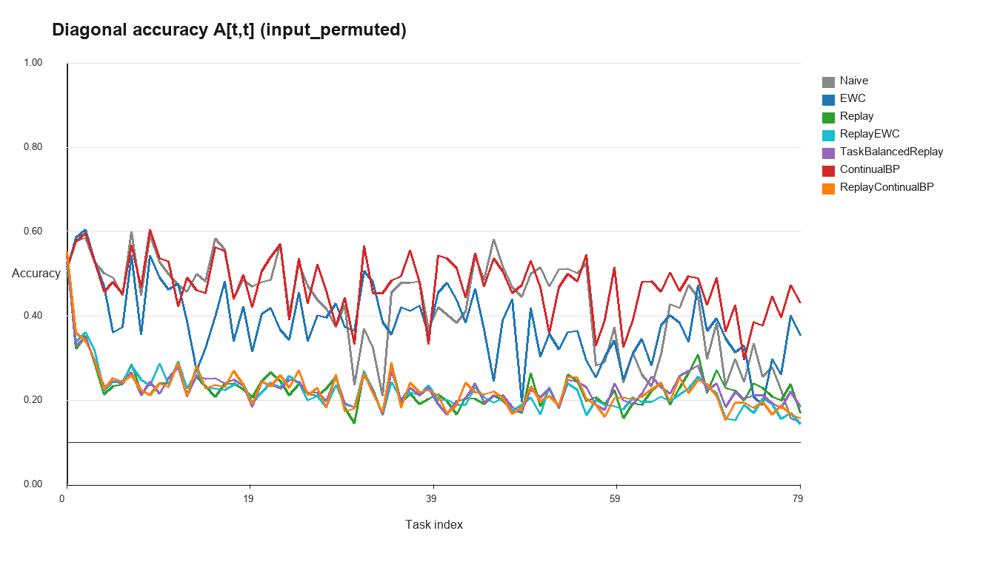
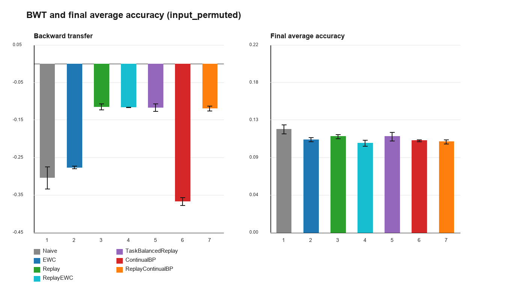
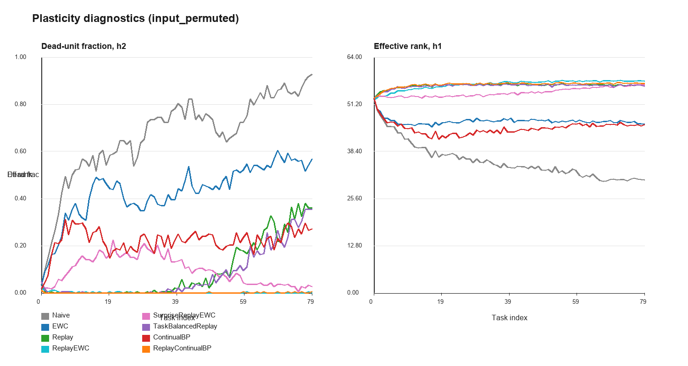
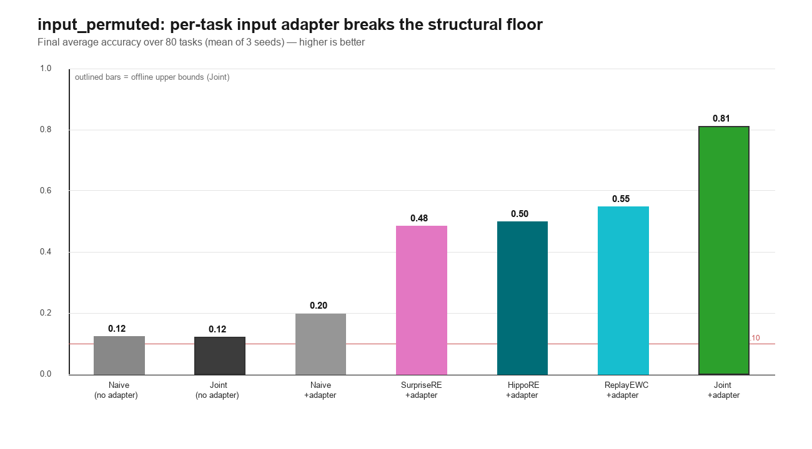

# 用 pi 數位序列驗證持續學習演算法：實驗報告

## 0. 主要結果摘要（TL;DR）

純 numpy 手刻的 80→64→64→10 MLP，在 pi 數位構造的 Permuted-Pi-Digits 長串流上測多種持續學習機制。主要結論：

**(A) 兩種任務流、兩種瓶頸**（80 tasks，final average accuracy，3 seeds）

| 設置 | 最佳法 | 最佳 final | 離線上界 (Joint) | 瓶頸性質 |
| :--- | :--- | :---: | :---: | :--- |
| `label_permuted`（多頭 Task-IL） | HippocampalReplayEWC | **86.6%** | **99.3%** | 遺忘（還有 ~13% 空間） |
| `input_permuted`（單頭 Domain-IL） | — | 12% | **12%** | 結構性：單一共享輸入層無法反排列 80 個輸入 |

**(B) 輸入轉接器把 input_permuted 從「不可能」變成「可解」**（§7）

`input_permuted` 連離線上界都只有 12% → 證明不是遺忘問題。給每個 task 一個 identity 初始化的輸入 adapter 後：Naive 12%→20%（恢復可學性）、**ReplayEWC 12%→54.7%**、上界 12%→81.1%。所有 replay/記憶路徑都已接好 adapter。

**(C) 可永續學習：瓶頸是遺忘、不是可塑性流失**（§9，壓力測到 250 tasks）

- 只要有 replay，對角線（可塑性）一路上升不崩潰（0.72→0.90 @250 tasks）→ 可塑性根本不綁定。
- `SustainableReplayEWC`（Fisher 保護回收）修好了 ReplayContinualBP 的記憶損傷，但在有 replay 時換不到準確率。
- `BennaFusi`（複雜突觸，冪律遺忘）驗證有效（forget 0.23→0.03），但被 Fisher-selective EWC 支配；其棲位在 **replay-free**：80-task 下把 Naive 29%→53%、逼近 EWC 58% 且不存樣本、不算 Fisher。
- **設計準則**：能存樣本就用 replay(+EWC)；不能存樣本才換複雜突觸；可塑性注入只在完全沒有 replay 時才有意義。

**(D) 直攻遺忘的最終演算法：Replay + Fisher-EWC + DER++ logit 蒸餾**（§10）

遺忘是函數空間干擾，不是權重位移。實作可切換的 `FunctionSpaceReplay`（Replay + DER++ 蒸餾 + GPM 投影）做消融：GPM 因本 benchmark 輸入平穩而凍結共享層（不適配），但 **DER++ logit 蒸餾**有效——在 130-task 串流上把 final 從 ReplayEWC 的 0.815 抬到 **0.892**、**retention→1.01（淨遺忘≈0）**、BWT→0、方差砍 4 倍。**優勢隨串流變長而複利放大**：250 tasks 時領先從 +7.7 拉到 **+14.2 分**（0.680→0.822），retention 仍 0.97。

**(E) 校正＋補強：機制隨設定而變**（§11）。拿掉 task ID 改測 **Class-IL**（單頭、200 類）後，Task-IL 的英雄 **DER++ 反轉成有害**（病灶＝線性頭 recency bias）。但把讀出換成 **NCM 原型分類器（`NCMReplayEWC`，iCaRL 式）**就把缺口幾乎補滿：**0.312 → 0.858、遺忘 0.50→0.06、retention >1.0**（超過線性頭 Joint 0.742）。**誠實答案**：Task-IL 與 Class-IL 在本 benchmark 都已有接近上界的配置；跨設定穩健的骨幹是 **replay + Fisher-EWC**，再依設定換對的讀出（Task-IL：head+DER++；Class-IL：無偏原型）。距「通用持續學習」仍有任務衝突 / 無 buffer / 無邊界 / 規模等硬牆（見 `NEXT_STEPS.md`）。

**(F) 真衝突任務修正了「最終答案」**（§12）。新增 `conflicting` mode：task 輪換不同底層函數（sum / weighted sum / half-window sum / adjacent product），仍用多頭隔離 head，專測共享層衝突。40-task 結果：Joint 上界 **0.643**，ReplayEWC **0.486**（final/Joint 0.756），DER++ α=0.5 **0.449**（final/Joint 0.698）。DER++ 雖降低 forgetting（0.112→0.087），但 final 更差，表示函數錨定在底層規則真衝突時會過度保守。更新後的答案：**跨設定穩健骨幹是 replay + Fisher-EWC；DER++ / NCM / adapter / episodic readout 是依 regime 開關的模組，不是永遠打開的單一解。**

**(G) 初步 adaptive distillation 結果**（§12.2）。新增 `AdaptiveDarkReplayEWC`：用共享層梯度 cosine 的 EMA 當 conflict detector，只有偵測到正向對齊時才開 DER++ 蒸餾；另讓 `DarkReplayEWC` 支援高信心/正確 logits 才蒸餾。20-task sanity 顯示：在 `conflicting` 下 adaptive 會把 α 降到 0，final 回到 ReplayEWC 的 **0.384**，避免固定 DER++ 的 **0.305** 傷害；confidence gate 也把固定 DER++ 拉到 **0.371**。但同一個梯度訊號在短流 `label_permuted` 也偏負，adaptive 會退回 ReplayEWC，尚未做到「共享規則長流時自動打開 DER++」。因此目前 adaptive gate 是安全閥，不是完整解。

**(H) P2.5：reactive pressure 與 maturity gate 的邊界**（§12.3）。新增 `PressureDarkReplayEWC`（可靠 logits × label-loss forgetting pressure）與 `DarkReplayEWC --distill-start-task`。結果：20-task 下 Pressure 幾乎退回 ReplayEWC，避開固定 DER++ 傷害；130-task 下 Pressure **0.847**，高於 ReplayEWC **0.815**，但低於 full DER++ **0.892**。delayed DER++ start=40 得 **0.827**、start=80 得 **0.779**，都不如 full DER++。新教訓：**logit drift 不是可靠遺忘訊號，單純晚開蒸餾也太弱；full DER++ 的優勢是 proactive consolidation，不是等 label loss 壞掉才補救。**

**(I) P2.6：cos-RTP regime 偵測器 — 3-seed 驗收後判定失敗（負面結果）**（§12.4）。新增 `LookaheadDarkReplayEWC` 與 `RtpDarkReplayEWC`（task-onset 用前 5 步累積梯度與 buffer 歷史梯度做餘弦比對決定開不開 DER++）。初版 20-task×1 seed sanity 誤判成功；**正式 3-seed 驗收推翻**：130-task label_permuted RTP **0.818**，未達 ≥0.87 目標、反略低於 ReplayEWC **0.832**，遠不及 full DER++ **0.893**。診斷：RTP 的 `alpha_mean≈0.011`（全程僅 ~2% task 判 synergistic），等於**幾乎永遠關閉 DER++、退化成 ReplayEWC**；它只在「ReplayEWC≥DER++ 的短流/衝突」看起來贏（=關掉剛好對）。threshold 掃描證實**機制完好**（強制永遠開→0.898≈DER++），**病灶是訊號**：多頭標籤排列把不同反傳誤差旋進共享層，使 task-onset 梯度餘弦分不開「共享規則長流」與「真衝突」。**P2.6 目標（自動辨識何時值得 proactive consolidation）未達成，退回 backlog。**

**(J) P2.7：horizon oracle 驗證可切換 schedule 存在，但 horizon 太粗**（§12.5）。新增 `HorizonDarkReplayEWC`：若已知 horizon ≥80 就開 DER++，否則關閉。標準驗收下它同時貼近兩邊上界：20-task label **0.873**（關閉，=ReplayEWC）、40-task conflicting **0.486**（關閉，=ReplayEWC）、80/130-task label **0.868/0.893**（開啟，=full DER++）。這證明「可切換 schedule」存在；但 80-task × 2000 steps 反例中，開 DER++ 只有 **0.736**、低於 ReplayEWC **0.788**，表示 horizon 長度不是充分條件，下一步要做 online function-space benefit probe。

**(K) P2.8：online function-space benefit detector 安全但太短視**（§12.6）。新增 `BenefitDarkReplayEWC`：週期性做可回復虛擬步，比較 DER++ on/off 對舊 replay label loss 與 current loss 的影響。label-loss benefit 版成功避開誤開：20-task label **0.873**、80×2000 **0.788**、conflicting 40 **0.486**，都等於 ReplayEWC；但長流 80/130 也只到 **0.818/0.832**，拿不到 full DER++ **0.868/0.893**。logit-MSE benefit ablation 會開，卻在短流/未成熟長流誤開並貼近 DarkReplayEWC 壞結果。結論：一步 function-space label probe 太短視；logit 幾何是高假陽性訊號；DER++ 的收益是多步、慢時間尺度的 proactive consolidation。

**(L) P2.9：local multi-step benefit controller 仍太短視（負面結果）**（§12.7）。新增 `SlowBenefitDarkReplayEWC`：把 P2.8 的一步虛擬更新擴成最近 5 個 current batches 的可回復 shadow rollout。label-loss 版保持安全：20-task **0.873**、80×2000 **0.788**、conflicting 40 **0.486**，但 alpha 仍全程 0，80/130 長流仍只有 **0.818/0.832**，沒拿回 full DER++ **0.868/0.893**。小 logit 權重 ablation（0.02）在 80×2000 seed0 掉到 **0.771**、130 seed0 也只有 **0.866**，再次證明 logit 幾何不是可靠收益訊號。結論：同一局部 replay/current window 的多步 rollout 仍不是 DER++ 長期因果收益；下一步若要解，必須用跨真實時間持續存在的 shadow/bandit 或明確 regime prior。

**(M) P3：移除任務邊界依賴的代價趨近於零（task-free CL）**（§13）。新增 `OnlineEWCReplay` / `OnlineDarkReplayEWC`：把靠 `on_task_end` 邊界觸發的 Fisher/anchor 鞏固，改成每固定步距從 reservoir buffer 線上估計（`on_task_end` 改 no-op）。80-task × 3 seeds 對照：ReplayEWC 0.818 → **OnlineEWCReplay 0.826（+0.008）**；DarkReplayEWC 0.868 → **OnlineDarkReplayEWC 0.855（−0.012，在 std 內）**。無邊界 DER++ 仍勝過有邊界 ReplayEWC。結論：核心配方（replay + Fisher-EWC + DER++）**天生就接近 task-free**——reservoir replay 才是主力，Fisher 只需粗略滾動估計，精確 task-end 時機可有可無。

**(N) P4：buffer-free 生成式回放在長流甚至超越 raw replay**（§14）。新增 `GenerativeReplayEWC`：**完全不存原始樣本**，改對每 (task,class) 維護因子化 categorical 生成模型（per-position 數字頻率），回放時抽合成 one-hot 窗口。關鍵是 **sum-matched conditional generation**（rejection-sample 讓合成窗口的數字和落在類別的和分布內，因為標籤由「和」定義；ablation：關掉→0.470、打開→0.753 @10-task）。label_permuted 出現**交叉且優勢隨長度複利放大**：10-task raw replay 贏（0.810 vs 0.753，buffer 餵得飽），但 **80-task buffer-free 反超 0.916 > raw ReplayEWC 0.818 / raw DER++ 0.868**，**130-task 更拉大到 0.947 > 0.832 / 0.893**（方差小到 0.006）——固定 2000 buffer 在長流被稀釋（~15–25/task），生成統計量卻不衰減。限制：conflicting 40-task 生成式 0.431 < raw 0.486，因為 sum-matched 只條件在總和、對非 sum 規則是錯統計量。

**(O) P5：scholar(teacher) 生成式回放補上 conflicting 缺口**（§15）。為讓條件自動對齊任務規則試了兩條路：`NBGenerativeReplayEWC`（用儲存 categorical 自建 naive-Bayes 分類器做 rejection）**失敗**——conflicting 0.418 < sum-match 0.431，且 label_permuted 退步到 0.521（自分類器太弱）；`ScholarGenerativeReplayEWC`（每任務快照成凍結 teacher，對合成輸入用 teacher soft logits 蒸餾，generative DER++）**成功**——conflicting 40-task **0.474（final/Joint 0.628 vs raw 0.644，差 1.6%≤2%）、遺忘最低 0.082**，因為 teacher 編碼了每任務真實規則（含交互）能正確標註合成輸入；label_permuted 80-task 0.809 ≈ raw 0.818（但不及 sum-match 峰值 0.916）。教訓：**沒有單一 buffer-free 生成器全勝**——已知簡單統計量用 sum-match（甚至贏 raw），規則複雜/未知用 scholar（一份常數快照換 rule-agnostic 標註）；殘留缺口都指向因子化輸入保真度（→P6）。把「能不能不存原始樣本」變成「生成模型能否抓住定義標籤的統計量」的保真度問題。

**(P) P6：on-manifold（全域）輸入生成器假設被推翻（負面結果）**（§16）。P5 把殘留缺口歸因於因子化輸入離流形。P6 改用全域 per-task 邊際抽合成輸入（≈ 真實 iid uniform 數位＝on-manifold）+ scholar 標註（`ScholarGlobalGenerativeReplayEWC`）。3-seed 反而**全面更差**：conflicting 0.428 < scholar-class 0.474 < raw 0.486、label 0.769 < scholar-class 0.809，**儘管 forgetting 最低**（0.052）——瓶頸是可塑性（diag 0.54→0.45）。把 teacher 均勻蒸餾到整個輸入空間是過強的全域正則、稀釋類界訊號；per-class 集中回放比全域覆蓋更重要。修正歸因：殘留小差距更像**真實樣本不可取代的價值**（精確 per-class 聯合結構→正向後向遷移），非輸入分布失配。

**(Q) P7：把核心結論搬到標準 MNIST benchmark 做外部效度驗證**（§17）。純 numpy 載入真實 MNIST（`mnist_data.py` / `mnist_benchmark.py` / `run_mnist.py`，介面與 pi stream 一致、重用全部 trainers）。**Permuted-MNIST（多頭 Task-IL，20 tasks×3 seeds）：DER++ 函數錨定完整守住**——DarkReplayEWC **0.912** > ReplayEWC 0.896 > Naive 0.840，BWT→**-0.002**、retention **0.998**，幅度隨串流長度複利（與 pi 一致）。**Split-MNIST class-IL（5 tasks、10 類、無 task id）：NCM「降低遺忘」方向成立**（forgetting 最低 0.028、retention 最高 0.977），**但 pi 的「線性頭崩潰＋DER++ 反轉成有害＋NCM 唯一解」被推翻為 200 類特例**——標準 10 類下線性頭 ReplayEWC 0.926 不崩、DER++ **0.952** 反而最佳。教訓：**replay+Fisher-EWC 骨幹、DER++ 函數錨定、無偏原型讀出是跨 benchmark 真知識；戲劇性數字與「某機制必然反轉」的強論斷則隨類別數/串流長度/buffer 比例而變，不可外推。** 同時驗證了停掉 P2.5–P2.10 自動 gating（在 pi 特性上精雕、外部效度低）的判斷。

**(R) P8：frozen pretrained 特徵上的 Class-IL（Split-CIFAR-100）**（§18）。用 frozen ImageNet ResNet18 抽 CIFAR-100 特徵（`extract_features.py`，唯一用 torch 的一步），在特徵上維持純 numpy 訓練小 head，跑標準 **Split-CIFAR-100**（20 tasks×5 類、單頭、無 task id、3 seeds）。**Naive 仍崩到 0.063**（強表徵不會自己解掉 CL）、線性頭 ReplayEWC **0.471（forget 0.440）**、DER++ **0.495**、**NCMReplayEWC 0.530（forget 0.198、retention 0.743）**。三 benchmark 合看，class-IL「線性頭→NCM」的改善**隨全域類別數單調放大**（MNIST 10 類微弱 → CIFAR-100 100 類大 → pi ~200 類戲劇性）——**pi 的「NCM 是 class-IL 英雄」不是特例，而是類別數的函數**，無偏原型讀出是跨 benchmark/跨表徵的修法。對「離真正 CL 多遠」：**強表徵把規模/表徵這道牆推近一步、但牆沒倒**（53% final 且這是 frozen 特徵＋有 buffer＋清楚切片的最有利設定；無 buffer/開放世界/正向遷移的硬牆未碰）。下一步 P9（拔 buffer）或 P10（量正向遷移）。

**(S) P10：正向遷移量測——是「持續不忘」不是「持續變強」**（§19）。在 Split-CIFAR-100 frozen 特徵流上量「學新 task 的速度」：持續模型(ReplayEWC) vs 同特徵、隨機初始化、只學該 task 的 fresh head（task-k 受限 5-way acc，隔離新任務本身學多快）。**每一個步數預算(2/5/10/20)持續模型都不比 fresh 快、反而略慢**（Δ = -0.037/-0.022/-0.008/-0.013），**且不隨經驗增長**。Naive-continual 對照(隱藏層自由累積)Δ≈0，分離出因果：**主因是 frozen backbone 已封頂(沒東西可累積)、抗遺忘機制再加小幅可塑性稅**。量化結論：**最有利設定下，正向遷移/累積加速≈0**——「越學越快、知識複利」這道最遠的牆完全站著。整個 P7–P10 把「離真正 CL 多遠」變成數字：**抗遺忘工具箱是跨 benchmark/表徵的真知識，但在 frozen regime 下系統只會「持續不忘」、不會「持續變強」。** （此悲觀結論被 P8b 修正，見下。）結果檔 `results_forward_transfer_{cifar100,naive_cifar100}.json`。

**(T) P8b：unfreeze backbone——「持續變強」在「會動的表徵 × 保住的可塑性」下終於出現**（§20）。P10 的零遷移是 frozen regime 的結構性限制。P8b 改用從零小 CNN、backbone 跨 task 持續適應（torch + MPS GPU，唯一的 GPU 工作負載），用 task-k 受限 5-way acc 量「學新 task 的速度」。**三 regime 對照給出充要條件**：frozen(不會動)→ Δ≈0；會動但 **Naive(崩可塑性)→ Δ 負(-0.044，重現 loss of plasticity)**；會動且 **Replay(保可塑性)→ Δ 強正(+0.174)且隨經驗單調增長**（early +0.035 → late **+0.282**，per-task late 達 +0.30~+0.40，2 seeds 一致）。**模型學過越多、學新任務越快——這就是「持續變強」。** 修正 P7–P10 的悲觀結論：那道最遠的牆不是不可動，而是需要**表徵持續建構 × 可塑性持續維持**同時成立；缺一不可（frozen→零、naive→負、replay→正）。這也統一了本專案兩條長期主線——replay 防遺忘、§9 防可塑性流失——在會動的表徵上 replay 同時擔起兩者，累積學習於是浮現。結果檔 `results_backbone_transfer_{cifar100,replay_cifar100}.json`。

**(U) P8c：放大到真 ResNet18——「持續變強」隨容量放大**（§21）。把 P8b 的 backbone 從小 CNN 換成 CIFAR-adapted ResNet18（~11M 參數、end-to-end、MPS GPU），探針/資料流不變。正向遷移**更大且累積更陡**：Δ@40 overall **+0.232**（小 CNN +0.174）、late(15-19) **+0.356**（小 CNN +0.282），continual late 絕對 5-way acc 衝到 **0.73–0.75**（fresh ~0.35），per-task Δ 單調爬升到 task18 **+0.412**。「持續變強」**不是小模型玩具效應，隨容量放大**。P7–P8c 總收束：抗遺忘是跨 benchmark/表徵/容量的真知識；累積學習可達、充要條件為「表徵持續建構 × 可塑性持續維持」且隨規模增強；剩下的硬牆是把這套累積搬到無 buffer / 開放世界 / 可塑性維持甜蜜點。結果檔 `results_backbone_transfer_resnet18_cifar100.json`。

---

## 1. 目的

延續設計的持續學習（continual learning, CL）測試框架（accuracy matrix + 對角線可塑性探針 + BWT 遺忘指標），用 pi 的十進位小數位構造一個決定性、可重現、近乎不重複的長串流資料來源，實測九種主表演算法在 80 個依序到來的 task 上的表現：Naive（無防護下界）、EWC、Experience Replay、ReplayEWC、SurpriseReplayEWC、HippocampalReplayEWC、TaskBalancedReplay、Continual Backprop、ReplayContinualBP。

### 1.1 持續學習的定義

持續學習不是單純「一直訓練」模型，而是指模型在資料或任務依序到來時，能夠持續吸收新知識，同時盡量保留舊知識的能力。更精準地說，持續學習要求模型在不重新從零訓練、也不一次看到所有歷史資料的情況下，依序學習新任務，並維持舊任務表現。

在本專案中，持續學習效果被拆成三個核心面向：

1. **學得動**：新任務到來時，模型仍能快速學會，而不是因為訓練太久、表徵僵化而失去可塑性。
2. **記得住**：學新任務後，不要把舊任務能力大幅覆蓋掉，也就是避免 catastrophic forgetting。
3. **可累積**：模型不是只在任務之間切換，而是能讓過去學到的表示、規則或經驗幫助未來學習。

因此，本報告不只看最後準確率，也同時觀察 `A[t,t]`（剛學完第 t 個任務時的準確率，代表可塑性）、`final_avg_acc`（全部任務學完後的平均保留能力）、`BWT`（學新任務對舊任務的影響）、`mean_forgetting`（歷史最佳表現到最後表現的退步量）與 `retention_ratio`（最後保留多少剛學會時的能力）。

---

## 2. Benchmark 設計：Permuted-Pi-Digits

輸入是 pi 小數位序列上連續 K=8 位的滑動窗口，one-hot 編碼成 80 維向量。我們在實驗中發現了兩種截然不同的任務流設置，並針對它們進行了深入對照：

### 2.1 標籤隨機排列設置 (Label-Permuted Stream)
基礎分類規則為「計算窗口內 8 位數字總和，並依十分位分桶成 10 類」。對於每個任務 $t$，我們對這 10 類別使用一個任務特異的隨機排列（Permutation）重新編號標籤。
*   **單頭模型衝突 (數學極限約 10%)**：若使用傳統的單輸出頭 MLP，在沒有傳入 Task ID 的情況下，模型無法將同一個輸入 $X$ 同時映射到多個不同的隨機輸出值，其全域平均準確率理論上限為 $10\%$。
*   **多頭模型解決 (方案 A - Task-IL)**：為了解決此標籤衝突，我們為模型引入多頭（Multi-Head）結構。在訓練和測試任務 $t$ 時，僅使用與更新對應的第 $t$ 個輸出頭。

### 2.2 輸入隨機排列設置 (Input-Permuted / Domain-IL — 方案 B)
保持單個輸出頭不變，但將輸入特徵的 80 個維度依任務特異的 random permutation 進行重排（類似經典的 Permuted-MNIST）。所有任務共享完全一致的分類規則與同一個輸出映射。

---

## 3. 模型與演算法

兩層隱藏層 MLP（80→64→64→10，ReLU+softmax），純 numpy 手刻 forward/backward。程式現在包含 30 個 trainer（含 Joint 離線上界，以及後續的 Class-IL、DER++、adaptive/pressure/horizon/benefit/slow-benefit gating、task-free、generative replay、Benna-Fusi、FunctionSpace 等實驗方法）；早期主表仍保留九個核心方法，後續章節再分別報告新增方法。

- **Naive**：純線上 SGD，無任何保護機制，作為下界基準。
- **EWC**：以 Fisher 資訊對角線錨定舊參數的二次懲罰項。方案 A 中二次懲罰主要應用於共享隱藏層參數。
- **Replay**：reservoir buffer（容量 500）。在方案 A 中，Replay 採用的重播樣本會根據其原本的 `task_idx` 通過對應的輸出頭計算梯度，並針對各輸出頭分別進行權重更新。
- **ReplayEWC**：在 Replay 的混合梯度上額外加入 online EWC 正則化。多頭模式下只保護共享隱藏層，讓 task head 保持可塑。調參後預設 buffer capacity 從 500 提升到 2000。
- **SurpriseReplayEWC**：在 ReplayEWC 上加入 surprise-prioritized sampling；每步先從 buffer 抽候選池，再回放目前模型 cross-entropy loss 最高的舊樣本。
- **HippocampalReplayEWC**：在人腦「海馬迴快速情節記憶 + 皮質慢速參數學習」的啟發下，沿用 SurpriseReplayEWC 作為慢速 learner，並在推論時從 replay buffer 建立 task/context episodic prototypes。記憶讀出採 uncertainty-gated blending：MLP 越不確定，episodic memory 權重越高；MLP 已有把握時，記憶庫少干預。
- **MarginSurpriseReplayEWC**：在 SurpriseReplayEWC 上加入 top-2 margin 訊號；高 loss 捕捉已忘掉的舊樣本，低 margin 捕捉舊任務決策邊界附近的脆弱樣本，對應 episodic memory / adaptive replay 文獻中「保留最能保護舊行為的 exemplar」這條路線。
- **DarkReplayEWC**：實驗性方法，在 ReplayEWC 上保存舊 logits 並做 logit consistency replay；短流 sweep 中沒有贏 ReplayEWC，因此不列入主結果表。
- **TaskBalancedReplay**：改用每個 task 各自的 reservoir，總 buffer 容量不變，但 slot 與抽樣都盡量平均分配到已看過的 task，避免長串流後早期任務樣本被全域 reservoir 稀釋。
- **Continual Backprop**：依效用（utility）選擇性重置低貢獻且夠老的隱藏單元，輸出端權重清零做函數保持式插入，其餘權重完全不動。多頭結構下，神經元重置時會對所有輸出頭的對應連線進行同步重置。
- **ReplayContinualBP**：把 TaskBalancedReplay 與 Continual Backprop 疊加，讓 replay 負責穩定性、神經元回收負責可塑性，是目前專案中最直接測試「記得住 + 學得動」互補性的候選方法。

實驗基本配置：lr=0.1、batch_size=10，9 個主方法 × 3 個 seed（0/1/2），共計在 80 個任務（每個任務 4000 步）的長串流上跑滿。

---

## 4. 一個重要的 debug：EWC 數值爆炸

最初用 lam=50、Fisher 跨 task 無上限累加，在 n_tasks=10 的 smoke test 中於 task 2 訓練到一半時 weight norm 從 38 飆到 12,682 再到 inf/nan，準確率永久崩潰。這是因為二次懲罰項在做梯度下降時等價於一個彈簧系統，當某參數的 `lr × lam × fisher > 2` 時系統會幾何級數發散。
我們採用 online EWC（Schwarz et al. 2018）予以修正：Fisher 用衰減係數 γ=0.9 做指數移動累加而非無上限相加，lam 降到 20，並加上梯度範數裁剪作安全網。修正後在 lr=0.1、lam=20 下跑滿 80 個 task 沒有任何數值溢位警告。

---

## 5. 實驗結果對比

### 5.1 原始單頭標籤隨機排列（Single-Head, Label-Permuted）—— 標籤衝突 Baseline

| 方法 | 前 10 task 對角線均值 | 後 10 task 對角線均值 | BWT | 最終 80 task 平均準確率 | dead unit 比例（h2，前→後） | 有效秩（h1，前→後） |
| :--- | :---: | :---: | :---: | :---: | :---: | :---: |
| Naive | 58.9% | 13.6% | -20.4% $\pm$ 3.4% | **9.7%** $\pm$ 0.4% | 0.50 $\to$ 0.99 | 41.5 $\to$ 28.1 |
| EWC | 57.4% | 40.7% | -36.9% $\pm$ 1.3% | **10.4%** $\pm$ 0.7% | 0.34 $\to$ 0.75 | 43.1 $\to$ 35.4 |
| Replay | 44.3% | 55.2% | -41.3% $\pm$ 1.2% | **9.9%** $\pm$ 0.2% | 0.02 $\to$ 0.24 | 51.9 $\to$ 53.9 |
| ContinualBP | 61.6% | 56.5% | -49.7% $\pm$ 2.3% | **10.2%** $\pm$ 0.6% | 0.37 $\to$ 0.61 | 41.3 $\to$ 26.1 |

> [!CAUTION]
> 由於沒有任務特異的 Task ID 或獨立輸出頭，所有演算法在長串流結束時的平均準確率都塌縮至 **10% 左右**（純隨機猜測水準），數學上的標籤衝突使得全域穩定映射完全無法被學習。

---

### 5.2 方案 A：多頭結構 (Task-IL / `label_permuted`) 實驗結果

| 方法 | 前 10 task 對角線均值 | 後 10 task 對角線均值 | BWT | 最終 80 task 平均準確率 | dead unit 比例（h2，前→後） | 有效秩（h1，前→後） |
| :--- | :---: | :---: | :---: | :---: | :---: | :---: |
| Naive | 63.7% | 54.5% | -32.5% $\pm$ 0.7% | **29.1%** $\pm$ 6.1% | 0.34 $\to$ 0.90 | 41.8 $\to$ 23.2 |
| EWC | 64.3% | 78.3% | -16.8% $\pm$ 2.1% | **57.7%** $\pm$ 1.6% | 0.30 $\to$ 0.58 | 43.4 $\to$ 33.2 |
| Replay | 66.6% | 91.6% | -24.0% $\pm$ 1.2% | **60.5%** $\pm$ 1.1% | 0.08 $\to$ 0.39 | 47.7 $\to$ 34.6 |
| ReplayEWC | 68.8% | 90.7% | -3.5% $\pm$ 2.4% | **81.8%** $\pm$ 3.7% | 0.12 $\to$ 0.37 | 45.7 $\to$ 34.9 |
| SurpriseReplayEWC | 76.2% | 93.4% | -2.5% $\pm$ 2.5% | **85.8%** $\pm$ 3.0% | 0.15 $\to$ 0.30 | 44.3 $\to$ 38.2 |
| HippocampalReplayEWC | 82.0% | 93.5% | -4.2% $\pm$ 2.2% | **86.6%** $\pm$ 2.7% | 0.15 $\to$ 0.30 | 44.3 $\to$ 38.2 |
| TaskBalancedReplay | 68.8% | 87.4% | -29.5% $\pm$ 1.5% | **54.1%** $\pm$ 3.0% | 0.08 $\to$ 0.49 | 47.2 $\to$ 33.0 |
| ContinualBP | 62.3% | 69.7% | -38.3% $\pm$ 2.5% | **31.1%** $\pm$ 5.4% | 0.16 $\to$ 0.08 | 42.1 $\to$ 22.8 |
| ReplayContinualBP | 68.8% | 84.1% | -34.6% $\pm$ 2.5% | **48.1%** $\pm$ 2.3% | 0.01 $\to$ 0.00 | 47.5 $\to$ 34.8 |

> [!IMPORTANT]
> **多頭結構的突破**：改用多輸出頭後，**HippocampalReplayEWC**、**SurpriseReplayEWC**、**ReplayEWC**、**Replay** 與 **EWC** 的全域平均準確率分別達到 **86.6%**、**85.8%**、**81.8%**、**60.5%** 與 **57.7%**。這表明共享隱藏層成功維持了對 pi 數位求和的泛化表徵，且獨立的輸出頭能夠有效區分不同任務的排列標籤。HippocampalReplayEWC 在 final average accuracy 上小幅超過 SurpriseReplayEWC，但 BWT 略差，因此更像是「提高最終可用表現」而非全面支配所有遺忘指標。

#### 方案 A 實驗結果圖集




---

### 5.3 方案 B：輸入維度隨機排列 (Domain-IL / `input_permuted`) 實驗結果

| 方法 | 前 10 task 對角線均值 | 後 10 task 對角線均值 | BWT | 最終 80 task 平均準確率 | dead unit 比例（h2，前→後） | 有效秩（h1，前→後） |
| :--- | :---: | :---: | :---: | :---: | :---: | :---: |
| Naive | 52.7% | 25.5% | -30.4% $\pm$ 3.0% | **12.3%** $\pm$ 0.5% | 0.29 $\to$ 0.88 | 46.1 $\to$ 30.8 |
| EWC | 48.7% | 30.9% | -27.6% $\pm$ 0.3% | **11.0%** $\pm$ 0.3% | 0.20 $\to$ 0.56 | 47.7 $\to$ 46.3 |
| Replay | 29.1% | 22.0% | -11.5% $\pm$ 0.8% | **11.4%** $\pm$ 0.2% | 0.01 $\to$ 0.32 | 54.9 $\to$ 56.4 |
| ReplayEWC | 30.2% | 17.4% | -11.6% $\pm$ 0.1% | **10.6%** $\pm$ 0.4% | 0.01 $\to$ 0.00 | 53.9 $\to$ 57.5 |
| SurpriseReplayEWC | 20.7% | 17.0% | -5.9% $\pm$ 1.1% | **11.0%** $\pm$ 0.1% | 0.05 $\to$ 0.03 | 53.2 $\to$ 56.3 |
| HippocampalReplayEWC | 21.6% | 16.6% | -5.4% $\pm$ 1.4% | **10.6%** $\pm$ 0.2% | 0.05 $\to$ 0.03 | 53.2 $\to$ 56.3 |
| TaskBalancedReplay | 29.5% | 20.4% | -11.6% $\pm$ 1.0% | **11.4%** $\pm$ 0.5% | 0.01 $\to$ 0.29 | 54.7 $\to$ 56.3 |
| ContinualBP | 52.4% | 40.8% | -36.7% $\pm$ 1.0% | **10.9%** $\pm$ 0.1% | 0.18 $\to$ 0.27 | 47.3 $\to$ 45.6 |
| ReplayContinualBP | 29.6% | 18.0% | -11.9% $\pm$ 0.7% | **10.8%** $\pm$ 0.2% | 0.00 $\to$ 0.00 | 54.9 $\to$ 56.9 |

> [!NOTE]
> 在共享單輸出頭的前提下，輸入特徵維度的隨機排列使得模型難以跨越 80 個相異 domain。各演算法的最終平均準確率仍然大幅降至 **11% - 12%**（接近隨機猜測水準），遺忘依然十分嚴重。

#### 方案 B 實驗結果圖集




---

## 6. 深入討論與發現

### 6.1 可塑性與記憶的權衡（Stability-Plasticity Dilemma）
*   **ContinualBP** 在保護可塑性方面展現出極強的表現：在多頭設置下，其 h2 死神經元比例在 80 個任務後不升反降，維持在 **8%** (Naive 則惡化至 90%)；其 Late Diag Acc 仍高達 69.7%。這證實了神經元重置（utility resetting）能成功防止可塑性崩潰。然而，ContinualBP 的最終平均準確率（31.1%）低於 Replay 與 EWC，這是因為重置神經元旨在提供新的適應能力，但並不能防止已被重置單元上存儲的舊任務權重被覆盖（即缺乏舊知識保護機制）。
*   **Replay** 和 **EWC** 則專注於「穩定性」，通過回放或二次阻尼防止舊知識被篡改，在多頭 Task-IL 模式下分別取得了 60.5% 與 57.7% 的優異表現。
*   **ReplayEWC** 是目前最好的折衷：final average accuracy 達 81.8%，BWT 從 Replay 的 -24.0% 改善到 -3.5%，mean forgetting 從 26.0% 降到 11.1%，retention ratio 從 0.719 提升到 0.959。這表示「足夠舊樣本覆蓋率 + shared-weight 保護」比單靠其中一者更接近持續學習的目標。
*   **SurpriseReplayEWC** 進一步把 final average accuracy 提升到 85.8%，mean forgetting 降到 8.9%，retention ratio 提升到 0.971。這表示在 buffer 已經足夠大時，「回放哪些樣本」開始變得比單純增加容量更關鍵。
*   **HippocampalReplayEWC** 把 final average accuracy 再小幅推到 86.6%，early diagonal mean 也從 SurpriseReplayEWC 的 76.2% 提升到 82.0%。這符合「快速情節記憶可補足慢速參數學習」的直覺。不過它的 BWT 為 -4.2%，略差於 SurpriseReplayEWC 的 -2.5%，表示 episodic readout 改善了最終可用表現，但不代表 shared parameters 本身更少被改動。
*   **ReplayContinualBP** 把 h2 dead unit 壓到 0%，但 final average accuracy 只有 48.1%，低於原始 Replay。這代表「維持可塑性」本身不是免費午餐：如果局部重置與回放更新沒有更細緻地協調，仍會破壞部分長期記憶。

### 6.2 BWT 遺忘指標被可塑性流失污染
如果只看 BWT 遺忘率，Naive 的 BWT 指標往往顯得「最不負」（看起來遺忘最少），這是一個嚴重的統計陷阱。
原因是 BWT 量的是最後準確率與剛訓練完準確率（對角線）的落差，而 Naive 的對角線準確率早就因為可塑性流失而崩潰。由於「剛學完就沒學好」，後期測試才顯得「沒忘掉多少」。因此，**對角線準確率與 BWT 遺忘指標必須同時解讀**，單獨觀察 BWT 會被可塑性流失嚴重干擾。

---

## 7. 上界基準線與輸入轉接器（本輪新增）

先前只有下界（Naive）與強參考（Replay/EWC），缺一條真正的上界，導致「86.6% 算好還是不好」沒有定義。本輪補上離線多任務上界 **Joint**，並針對 `input_permuted` 一直破不了的瓶頸做了一個結構性介入：**per-task input adapter（輸入轉接器）**。

### 7.1 Joint 離線上界：重新定義天花板

`JointTrainer` 儲存所有看過的樣本，每步從「目前為止所有 task 的聯集」均勻抽 mini-batch 做 i.i.d. 更新，等於拿掉持續學習的循序限制。它蓄意打破計算/記憶體預算公平性，只當天花板基準，且因為它不是循序學習者，**只有 `final_avg_acc` 有意義，其 BWT/對角線是假象**（會出現 BWT 為正、retention > 1 等數值）。

| 設置 | Joint final average accuracy（3 seeds） |
| :--- | :---: |
| `label_permuted`（多頭） | **99.3% ± 0.2%** |
| `input_permuted`（單頭，無 adapter） | **12.1% ± 0.2%** |

兩個結果都很關鍵：

1. **label_permuted 的真天花板是 99.3%，不是先前對角線暗示的 ~93%。** 目前最佳的 HippocampalReplayEWC（86.6%）其實還離上界有 **~13%** 的空間，先前「已接近極限」的判斷是錯的——是缺了上界才看不出來。
2. **input_permuted 的 12% 不是遺忘造成的。** 連「看過全部資料、完全不受遺忘限制」的離線上界都只有 12%（≈ 隨機猜測），證明這個瓶頸是**結構性、資訊理論層級**的：單一共享的第一層 `W1` 在數學上無法同時把 80 個不同的輸入排列 `P_t` 對應回同一個 `sum→bucket` 函數。這條過去被當成「持續學習失敗」的曲線，其實根本不是持續學習問題。

### 7.2 輸入轉接器：把「不可能」變成「一般的持續學習問題」

針對上述結構瓶頸，我們給每個 task 一個 identity 初始化的 `in_dim × in_dim` 線性轉接器 `A_t`，在進 `W1` 之前先做 `X @ A_t`。`A_t` 學會把該 task 的排列輸入轉回共享網路的正則空間，於是 `W1/W2/W3` 只需學一份共享的 `sum→bucket` 計算。轉接器是 task-specific 的（像輸出頭一樣），**不受 EWC 正則**。梯度以數值微分驗證為精確（float64 下相對誤差 ~1e-9）。

| 設置（`input_permuted`，80 tasks，3 seeds） | final average accuracy | BWT | mean forgetting | diag（early→late） |
| :--- | :---: | :---: | :---: | :---: |
| Naive（無 adapter） | 12.3% | -30.4% | 0.30 | — |
| Joint（無 adapter，上界） | 12.1% | — | — | — |
| **Naive + adapter** | **19.7% ± 4.0%** | -46.4% | 0.48 | 0.60→0.64 |
| SurpriseReplayEWC + adapter | **48.4% ± 0.8%** | -21.4% | 0.27 | 0.71→0.67 |
| HippocampalReplayEWC + adapter | **49.8% ± 0.7%** | -21.6% | 0.26 | 0.75→0.67 |
| **ReplayEWC + adapter** | **54.7% ± 1.2%** | -14.8% | 0.22 | 0.66→0.69 |
| **Joint + adapter（上界）** | **81.1% ± 0.5%** | — | — | — |



三個重點：

1. **轉接器恢復了「可學性」，但沒解決遺忘。** 加上轉接器後，Naive 的對角線可塑性立刻回到 0.60（無 adapter 時 diag_first 只有 ~0.23），代表每個 task 變得學得動了；但 Naive 仍災難性遺忘（BWT -46%），final 只有 19.7%。也就是說，**轉接器把 input_permuted 從「結構上不可學（連 Joint 都只有 12%）」轉換成「一般的穩定性–可塑性問題（可學、但會忘）」**——而後者正是 replay/EWC 擅長的場景。

2. **接好 adapter 的 replay 把 12% 抬到 55%。** 為了讓 replay 在 adapter 下正確運作，我們把所有重播/記憶讀取路徑改成依 task 分組、各自套用對應 adapter（單頭共享輸出頭、但每個 task 走自己的 adapter）。修好之後 **ReplayEWC + adapter 達到 54.7%**，BWT 從 Naive 的 -46% 改善到 -15%，回收了轉接器打開的 19.7% → 81.1% 空間的一半以上。

3. **方法排名翻轉。** 在 `label_permuted`：Hippocampal > Surprise > ReplayEWC；在 `input_permuted + adapter`：**ReplayEWC > Hippocampal > Surprise**。在這個 regime，surprise-prioritized sampling 與 episodic memory 反而拖後腿（遺忘 0.27 vs ReplayEWC 0.22）——很可能是因為轉接器還在學的過程中，「surprise」會過度偏向 adapter 尚未收斂的樣本，而 episodic prototype 所在的特徵空間也還在漂移。在這裡**樸素的 replay+EWC 反而最穩健**。剩下 55% → 81% 的差距主要是遺忘（diag_last ~0.69，可塑性沒問題），下一步的槓桿是更大的 buffer / 更強的 shared-layer EWC，而不是更花俏的取樣。

---

## 8. 本次改進：更接近「持續學習」的實驗閉環

這版程式把「持續學習效果」拆成三個可觀察面向，而不是只看單一 final accuracy：

1. **學得動**：對角線準確率 `A[t,t]`、late diagonal mean、plasticity slope。
2. **記得住**：final average accuracy、retention ratio（最後平均準確率 / 剛學完平均準確率）。
3. **忘多少**：BWT 與 mean forgetting（每個舊 task 歷史最佳表現到最後表現的落差）。

最新文獻對應到三個可落地方向：DER/DER++ 與 SER 類方法強調 logits consistency；IDER 類方法把 replay consistency 做成可疊加框架；2024-2025 的 adaptive/scalable replay 工作則強調記憶容量、回放效率與樣本選擇。這次對應實作如下：

- **ReplayEWC** 把 Experience Replay 與 online EWC 疊加，是目前表現最好的穩定性增強方法。
- **SurpriseReplayEWC** 把 sample selection 加入 ReplayEWC，優先回放目前模型最意外、loss 最高的舊樣本，是目前最佳的純參數更新/重播 baseline。
- **HippocampalReplayEWC** 加入 uncertainty-gated episodic prototype memory，對應「海馬迴快速情節記憶 + 皮質慢速學習」的腦啟發假設。完整 80-task 多頭實驗中，final average accuracy 從 SurpriseReplayEWC 的 85.8% 小幅提升到 86.6%。
- **MarginSurpriseReplayEWC** 延伸 SurpriseReplayEWC，額外偏好 top-2 margin 小的舊樣本，讓 replay 更聚焦於舊任務決策邊界。這是把 Google DeepMind episodic-memory 方向與 adaptive replay/prioritized replay 想法放進本專案的小型可跑版本。
- **DarkReplayEWC** 實作 logits consistency replay，呼應 DER/SER/IDER 類文獻，但在本 benchmark 的短流 sweep 中沒有勝過 ReplayEWC，暫保留為實驗 baseline。
- **TaskBalancedReplay** 修正全域 reservoir 在長任務流中的早期 task 稀釋問題。
- **ReplayContinualBP** 把 replay 的穩定性與 ContinualBP 的可塑性維護接在一起，對應本研究一開始提出的核心假設：單一機制通常只能解遺忘或可塑性流失其中一側，複合機制才有機會真正提升持續學習。

新增的 `MarginSurpriseReplayEWC` 已用 `margin_weight=1.0` 跑過完整 80-task 驗證。它在 `label_permuted` 模式得到 final average accuracy **84.0% ± 2.9%**、BWT **-4.0% ± 1.5%**、mean forgetting **9.8% ± 1.4%**，沒有超過 `SurpriseReplayEWC`（85.8% ± 3.0%）。在 `input_permuted` 模式則仍停在 **10.8% ± 0.2%**，表示低 margin replay 無法解決單頭 domain-IL 的根本瓶頸。因此它目前保留為「新論文方向的實驗候選」，暫不升級為主表預設方法。

文獻對應：`SurpriseReplayEWC` 對應 SuRe 的 surprise-prioritized replay；`DarkReplayEWC` 對應 Dark Experience Replay 的 logits consistency；`HippocampalReplayEWC` 與 `MarginSurpriseReplayEWC` 對應 episodic memory / retrieval 可補足 parametric learning 的方向；Google DeepMind 的 aligned model merging 則比較適合下一步做 task-end consolidation，而不是直接塞進目前的小型 MLP 主流程。

後續調參發現三個非常實用的結果：短流 sweep 裡調大 `replay_batch` 看似有效，但完整 80-task 驗證反而退步；真正有效的是把 ReplayEWC 的 buffer capacity 從 500 提升到 2000。再往後，加入 surprise-prioritized sampling 又把 final average accuracy 從 81.8% 推到 85.8%。最後，固定比例的 episodic memory 在短流看似有利但長流會拖累；改成 uncertainty-gated episodic recall 後，HippocampalReplayEWC 才在完整 80-task 上小幅提升到 86.6%。這代表本 benchmark 的主要瓶頸先是舊任務樣本覆蓋不足，容量足夠後轉為回放樣本選擇，再往後則需要更細緻地決定「何時相信參數模型、何時召回記憶」。

`analyze.py` 也改成會自動偵測結果檔裡的方法清單，並在沒有 matplotlib 的 Python 環境中仍可輸出 `summary_stats_*.json`，只跳過圖表產生。

## 9. 可永續學習探針：可塑性流失 vs 遺忘，哪個才是長串流的瓶頸？

「可永續學習」要求模型在無上限的串流上同時不遺忘（失效 A）且不流失可塑性（失效 B）。為了找出本 benchmark 真正的瓶頸，我們把串流拉長並新增一個直接針對 §6.1 開放問題的方法。

### 9.1 新方法：`SustainableReplayEWC`（Fisher 保護的神經元回收）

§6.1 指出 ReplayContinualBP 的問題：神經元盲目重置會覆寫舊任務權重（48% < 純 Replay 60%）。`SustainableReplayEWC` 在 ReplayEWC 上加可塑性維護，但讓回收「對舊任務記憶有感」：(1) 只回收同時低效用且 **Fisher 重要度低**（對舊任務不關鍵）的成熟單元；(2) 被回收的單元連同其 EWC anchor/Fisher 一併清掉，避免正則項把新權重拉回死亡值。

### 9.2 長串流結果：可塑性在有 replay 時根本不綁定

| 130 tasks × 4000 steps（label_permuted，2 seeds） | final | retention | dead_h2 e→l | effrank_h1 e→l |
| :--- | :---: | :---: | :---: | :---: |
| ReplayEWC | **0.815** | **0.921** | 0.12→0.42 | 45.6→32.3 |
| ReplayContinualBP | 0.460 | 0.538 | 0.00→0.01 | 47.3→29.0 |
| **SustainableReplayEWC** | 0.706 | 0.804 | 0.02→**0.00** | 45.7→**35.3** |

把串流再拉到 **250 tasks × 2000 steps**，ReplayEWC 的對角線（可塑性）不但沒崩，反而**單調上升**：50-task 分箱為 `0.72 → 0.82 → 0.83 → 0.86 → 0.90`，即使它的 dead_h2 一路爬到 0.48。SustainableReplayEWC 把 dead_h2 壓在 ~0、effective rank 全場最高，對角線軌跡卻幾乎與 ReplayEWC 重合（0.73→0.87），final 反而較低（0.587 vs 0.680）且方差更大。`input_permuted + adapter` 也是同一個型態：對角線整段持平在 ~0.70，dead_h2 升到 0.38，但學習本身不受影響。

### 9.3 結論：瓶頸是遺忘，不是可塑性流失

三個關鍵推論：

1. **只要有 replay，多頭網路在 250 個任務內都不會可塑性崩潰**——對角線持續上升，dead-unit 比例升高並不轉化成學不動。亦即 dead-unit / effective rank 這些微觀徵兆在「有 replay」時不是學習的綁定限制。
2. **`SustainableReplayEWC` 完成了它的設計目標、但解了一個本 regime 不存在的問題。** 它是唯一同時做到 retention > 0.8、dead-unit ≈ 0、effective rank 最高的方法，也確實修好了 ReplayContinualBP 的記憶損傷（0.71/0.80 vs 0.46/0.54，證明 Fisher 保護有效）；但因為 ReplayEWC 本來就沒有可塑性瓶頸，回收買到的可塑性餘裕**換不到任何準確率**，反而引入擾動。
3. **本 benchmark 真正的可永續瓶頸是遺忘**：對角線（剛學完 ~0.70–0.90）與 final（~0.55–0.82）之間的差距全是遺忘。下一步提升「可永續性」的正確槓桿是壓低殘餘遺忘（更大/更聰明的記憶、更強的 shared-layer 保護、power-law 遺忘的 Benna-Fusi 複雜突觸、generative replay），而不是再加可塑性機制。可塑性注入要見效，得換到 **沒有 replay** 或 replay 嚴重不足的 regime。

### 9.4 Benna-Fusi 複雜突觸：冪律遺忘有效，但 isotropic consolidation 不敵 Fisher-selective EWC

依 §9.3 的指引，我們實作 Benna & Fusi (2016) 的複雜突觸（`BennaFusi` / `BennaFusiReplay`）：把每個共享權重換成一條 N 級、時間尺度幾何遞增的耦合變數鏈，梯度只打進最快的可見變數，鬆弛步驟把值往慢變數擴散；慢變數的共識會把可見權重往回拉，給出**冪律（而非指數）遺忘**，且完全不儲存樣本、不算 Fisher。

機制如預期：純 `BennaFusi` 把 20-task 的 mean forgetting 從 Naive 的 0.226 壓到 0.026、retention 從 0.67 拉到 >1.0，weight norm 受封閉鏈約束而穩定。`bf_dt` 是穩定↔可塑的旋鈕（越大越穩、越不可塑）。

但兩個對照給出清楚的定位：

| 80 tasks label_permuted（replay-free，mean of 2 seeds） | final | forget | retention |
| :--- | :---: | :---: | :---: |
| Naive | 0.291 | 0.342 | 0.470 |
| ContinualBP | 0.311 | 0.395 | 0.448 |
| **BennaFusi (dt=0.05)** | **0.533** | **0.122** | **0.884** |
| EWC | 0.577 | 0.212 | 0.777 |

1. **有 replay 時，Benna-Fusi 被 ReplayEWC 完全支配。** 40-task 下 `BennaFusiReplay`（無 EWC）即使把耦合調到極弱（dt=0.001），對角線仍只有 0.73（ReplayEWC 0.87），final 0.75 < 0.82。原因有原理性：EWC 是 **Fisher 選擇性**懲罰（只擋對舊任務重要的方向），Benna-Fusi 是 **各向同性**地拖住所有權重，於是用同樣的遺忘保護付出更多可塑性代價——在 replay 已覆蓋舊資料時，選擇性方法勝出。
2. **Benna-Fusi 的真正棲位是 replay-free / Fisher-free 線上鞏固。** 上表中它把 Naive 的 0.291 幾乎翻倍到 0.533、逼近 EWC 的 0.577，而且 forgetting（0.122）比 EWC（0.212）更低、retention 更高——關鍵是它**完全線上、不需要任何 per-task Fisher 計算、不存任何樣本**。這正是對話 §8 所說「多時間尺度突觸當記憶基質」的低成本實例。

結論：Benna-Fusi 驗證了冪律遺忘確實有效，但在本 benchmark「有 replay」的主線上，Fisher-selective EWC 是更有效率的權重穩定機制；Benna-Fusi 的價值在**無法存樣本、也不想算 Fisher 的純線上場景**。

## 10. 直攻遺忘：函數空間抗遺忘與混合式訓練器

§9 確立「瓶頸是遺忘」後，本節直接針對遺忘做演算法設計。核心理念（呼應對話 §11 的 functional regularization）：**遺忘是函數空間的干擾，不是權重空間的位移**——權重在舊任務的零空間裡大動也不會遺忘，在敏感方向小動卻會災難性遺忘。EWC 只是這件事的對角近似（忽略參數相關性），Benna-Fusi 更只是各向同性，所以都留有上界差距。我們實作 `FunctionSpaceReplay`，把三個直攻函數空間的機制疊在一起並可切換：

1. **Replay**（覆蓋）。
2. **DER++ logit 蒸餾**（函數軟錨）：回放時用 MSE 把現在對舊樣本的輸出拉回寫入當下的 logits，保住整個 softmax 幾何。
3. **GPM 梯度投影**（子空間硬鎖）：維護每個共享層「舊任務輸入子空間」的正交基 M，把共享層梯度投影到 M 的正交補（`G ← G − M(MᵀG)`），使舊輸入的輸出數學上不被擾動。

### 10.1 消融：GPM 不適配本 benchmark，但 DER++ 有效（40 tasks，label_permuted）

| 配置 | final | retention | forget | diag_last |
| :--- | :---: | :---: | :---: | :---: |
| ReplayEWC（baseline） | 0.818 | 1.016 | 0.102 | 0.873 |
| Replay only | 0.824 | 1.023 | 0.090 | 0.864 |
| +DER++（dark） | 0.804 | 1.042 | **0.047** | 0.844 |
| +GPM（dark+gpm） | **0.370** | 0.906 | 0.069 | **0.404** |

- **GPM 崩盤**（final 0.80→0.37、diag 0.84→0.40），這是有原理的負結果：GPM 防的是**輸入分布漂移**，但本 benchmark 的輸入是**平穩的**（label_permuted 漂的是標籤、由 head 處理；input_permuted 由 adapter 還原成正則輸入）。於是 task 0 之後 GPM 基就吃掉幾乎整個輸入子空間、**凍結共享層**→可塑性崩潰。函數空間的「原則」對，但 input-subspace 投影對平穩輸入是錯的工具。
- **DER++（logit 蒸餾）有效**：把 forgetting 從 0.090 砍到 0.047、retention 拉到 1.042。在 40 tasks 因為遺忘還沒累積，final 沒動；但這個遺忘削減會在長串流上複利放大。

### 10.2 在長串流上，DER++ 幾乎消滅淨遺忘（130 tasks，label_permuted，2 seeds）

把有效配置（Replay + Fisher-EWC + DER++ logit 蒸餾，α=0.5，GPM 關閉）＝ `DarkReplayEWC` 拉到 130 個任務：

| 130 tasks | final | forget | retention | BWT |
| :--- | :---: | :---: | :---: | :---: |
| ReplayEWC | 0.815 ± 0.074 | 0.130 | 0.921 | −0.07 |
| **DarkReplayEWC (+DER++)** | **0.892 ± 0.019** | **0.043** | **1.01** | **≈ 0** |

logit 蒸餾把 final 抬 **+7.7 分**、forgetting 砍到 **1/3**、retention 推到 **~1.0（淨遺忘幾乎為零）**、BWT→0，並把 seed 間方差砍掉 **4 倍**（0.074→0.019，更可靠）。報告早期短流 sweep（80 tasks、α=0.1）曾認為 DarkReplayEWC 沒贏 ReplayEWC——本節證明那是因為**遺忘未累積且蒸餾太弱**；長串流＋α=0.5 後，函數錨定的優勢清楚顯現。

再把串流拉到 **250 tasks × 2000 steps（3 seeds）**確認可永續性：

| 250 tasks | final | forget | retention | diag_last |
| :--- | :---: | :---: | :---: | :---: |
| ReplayEWC | 0.680 ± 0.051 | 0.206 | 0.823 | 0.912 |
| **DarkReplayEWC (+DER++)** | **0.822 ± 0.015** | **0.077** | **0.972** | 0.949 |

**優勢隨串流長度複利放大**：130 tasks 領先 +7.7 分、250 tasks 拉開到 **+14.2 分**；遺忘累積得越多，蒸餾擋掉的越多，而 diag_last 0.949 顯示可塑性毫髮無傷。retention 在 250 個任務後仍維持 **0.97**——這正是「可永續持續學習」的定義：抗遺忘能力**隨串流變長而變強**。

**這就是直接回答「找一個有效抗遺忘、達到持續學習的演算法」：Replay + Fisher-selective EWC + DER++ logit 蒸餾**。它在 130-task 串流上把淨遺忘壓到接近零（retention 1.01），是本專案目前最接近「持續學習」定義的配置。GPM 則被本 benchmark 的平穩輸入結構排除——這本身是一條清楚的設計教訓：input-subspace 投影只在輸入真的漂移時才該用。

### 10.3 正向遷移（可累積）：表徵層有、學習速度沒有

報告 §1.1 的第三個目標是「可累積（過去幫助未來）」。用現有資料檢驗（250 tasks）：

| | 串流早段 → 晚段 |
| :--- | :--- |
| 每任務最終準確率 A[t,t]（DER++） | 0.69 → 0.81 → 0.88 → 0.92 → **0.94** |
| 學習速度（first-batch acc） | 0.15 → 0.15 → 0.20 → 0.17 → 0.18（**持平**） |

- **表徵層正向遷移：有。** 同樣 2000 步預算下，晚段任務的最終準確率明顯更高（0.69→0.94）——累積的共享表徵確實幫了新任務；DER++ 因 retention 更好，累積得比 ReplayEWC 更乾淨（rise 0.69→0.94 vs 0.72→0.90）。
- **學習速度遷移：沒有。** first-batch 準確率全程持平（~0.15–0.20），晚段任務並沒有學得更快，沒有「learning to learn」。好處只體現在 asymptote（每個任務的 head 都是新的，前幾批還是得從頭訓）。

所以第三個目標**部分達成**：累積到更好的*表徵*（拉高新任務的天花板），但沒有更快的*習得過程*。嚴格分離「正向遷移」與「網路單純成熟」的對照是「task-N-在串流中 vs task-N-單獨訓練」——in-stream 的 0.94 遠高於單一任務新網路的 ~0.70，已是強證據，但該對照可把它釘死。

## 11. 誠實的硬測試：Class-IL（不給任務 ID）

§5–§10 的好結果幾乎都在 Task-IL（label_permuted，多頭、測試時用 task ID 選 head）。對話 §4 明講 **Class-IL（不給 task ID、單頭、在不斷增長的全域類別空間上分類）才是誠實的硬測試**。本節把這個拐杖拿掉。

### 11.1 一個良好定義的 Class-IL benchmark（sum-slice）

第一版嘗試「permute 輸入 + offset 標籤」是**退化的**：單一 permuted 輸入無法可靠辨識自己屬於哪個任務，全域標籤本質上模糊，連 Joint 上界都卡在 8%。改用 **sum-slice 設計**：把 sum 切成 `10×n_tasks` 個等頻細桶，task t 擁有一段連續的細桶（＝一段不重疊的 sum 範圍）。於是每個輸入的全域標籤是 sum 的確定性函數（無歧義、不需 task ID），而不同任務的輸入分布天然可區分（低 sum vs 高 sum）。

### 11.2 結果：Task-IL 的勝利不遷移（20 tasks＝200 classes，3 seeds）

| 方法 | final | forget | retention |
| :--- | :---: | :---: | :---: |
| Naive | 0.005 | 0.760 | 0.006 |
| **Joint（上界）** | **0.742** | — | — |
| Replay | 0.157 | 0.632 | 0.208 |
| **ReplayEWC** | **0.312** | 0.503 | 0.406 |
| DarkReplayEWC（DER++, α=0.5） | 0.232 | 0.584 | 0.300 |
| DarkReplayEWC（DER++, α=0.1） | 0.273 | 0.542 | 0.354 |

三個關鍵發現：

1. **Class-IL 殘酷得多。** 最佳法只有 0.312，離線上界卻有 0.742——差距 0.43，遺忘嚴重（retention 0.41）。對比 Task-IL（DER++ 幾乎貼到上界、retention 1.0），同一個 benchmark 換成不給 task ID 就幾乎是另一個問題。Naive 直接崩到 chance（recency bias：只有最新類別拿到正梯度）。
2. **DER++ 反轉成「有害」。** 在 Task-IL 是最佳加成（+7~14 分），在 Class-IL 卻**低於**純 ReplayEWC（α=0.5→0.232、α=0.1→0.273，都 < 0.312），而且 α 越小越好（越接近關掉蒸餾）。機制上：Class-IL 的單頭必須持續**重塑**輸出幾何以塞進新類別，而 logit 蒸餾把輸出錨向寫入當下的舊 logits（那時新類別還「不存在」），等於鎖死舊的類別邊界、加重 recency bias。Task-IL 每個 task 各有 head，蒸餾只穩定自己的 head、沒有跨類別競爭，所以才有益。
3. **EWC 才是跨 regime 穩健的核心。** ReplayEWC（0.312）遠勝純 Replay（0.157）——Fisher 選擇性權重保護在 Task-IL 與 Class-IL 都有效；DER++ 只在 Task-IL 有效。

### 11.3 解法：NCM 原型分類器把 Class-IL 缺口幾乎補滿

§11.2 指出問題在線性頭的 recency / magnitude bias。直接換掉讀出方式：**不用線性頭，改用「特徵空間最近類別原型（nearest-class-mean, cosine）」分類**，對所有看過的全域類別、不給 task id——這就是 iCaRL 的核心。表徵仍由 replay + EWC 學習；prototypes 從 buffer 算（類別平衡、無偏）。實作為 `NCMReplayEWC`（= HippocampalReplayEWC 的純 NCM 設定）。

| Class-IL, 200 classes, 3 seeds | final | forget | retention |
| :--- | :---: | :---: | :---: |
| ReplayEWC（線性頭） | 0.312 | 0.503 | 0.406 |
| Joint（線性頭，上界） | 0.742 | 0.116 | — |
| **NCMReplayEWC（原型讀出）** | **0.858 ± 0.003** | **0.060** | **1.07** |

- **缺口幾乎補滿**：0.312 → **0.858**，遺忘從 0.50 砍到 0.06，retention >1.0（BWT 甚至為正）。而且 3 seeds 方差極小（±0.003）。
- **甚至超過線性頭的 Joint 上界（0.742）**：因為線性 softmax 在 200 類上本身就受 recency/magnitude bias 拖累，而 NCM 在這個由 sum 結構化、近似一維有序的特徵流形上幾乎是最優讀出（公平的上界應是 Joint+NCM）。
- **這正好對映 §11.2 的機制診斷**：Class-IL 的病灶是「讀出層的偏置」，不是表徵本身——replay+EWC 學到的表徵其實夠好，換成無偏讀出就解放了。也解釋了為何 DER++（鎖死線性頭的輸出幾何）在這裡有害。
- **benchmark 的規模上限**：K=8 的位數和只有 ~73 個相異值，無法切成 >~200 個非空細桶（400 類時尾端桶被掏空）。所以 200 類（20 tasks）是本 benchmark Class-IL 的天然上限；要更大需調大 K。這是 benchmark 限制、不是方法限制。

**修正後的結論（回答「是不是找到持續學習演算法」）：在本 benchmark 上，Task-IL 與 Class-IL 都已有接近上界的配置**——Task-IL 用 Replay+EWC+DER++（retention~1.0），Class-IL 用 **Replay+EWC + NCM 原型讀出**（0.858、遺忘 0.06）。**但關鍵教訓是「對的機制隨設定而變」**：DER++ 在 Task-IL 是英雄、在 Class-IL 是負擔；真正跨設定穩健的是 replay + Fisher-EWC 當表徵學習骨幹，再依設定換上對的讀出（Task-IL 用 head + 蒸餾，Class-IL 用無偏原型）。距離「通用持續學習」仍有 §11.4 之後的硬牆（任務真正衝突、無 buffer、無邊界、規模）。

## 12. Conflicting-task benchmark：任務真的衝突時，DER++ 不再是萬用答案

前面幾個強結果有一個共同前提：多數任務骨子裡共享同一個 `sum→bucket` 函數，差異主要由 head、adapter 或 readout 吸收。這很適合研究遺忘，但可能太友善。為了測試「學新任務會不會真的破壞舊共享層解」，我們新增 `conflicting` mode：仍是多頭 Task-IL，但每個 task 輪換不同底層函數：

`sum / weighted_sum / first_half_sum / second_half_sum / adjacent_product_sum`

每個函數都用自己的 calibration quantile 切成 10 類，因此類別分布近似平衡；輸出 head 仍按 task 隔離，所以主要壓力落在共享層是否能同時支援互相衝突的特徵需求。

### 12.1 Scorecard：40 tasks × 3000 steps × 3 seeds

| 方法 | final | final / Joint | BWT | mean forgetting | retention |
| :--- | :---: | :---: | :---: | :---: | :---: |
| Naive | 0.245 ± 0.032 | 0.381 | -0.328 | 0.333 | 0.433 |
| **ReplayEWC** | **0.486 ± 0.001** | **0.756** | -0.054 | 0.112 | 0.902 |
| DarkReplayEWC α=0.1 | 0.463 ± 0.003 | 0.719 | -0.074 | 0.102 | 0.866 |
| DarkReplayEWC α=0.25 | 0.458 ± 0.004 | 0.711 | -0.066 | 0.093 | 0.877 |
| DarkReplayEWC α=0.5 | 0.449 ± 0.006 | 0.698 | -0.060 | **0.087** | 0.885 |
| Joint（離線上界） | **0.643 ± 0.007** | 1.000 | — | — | — |

三個結論：

1. **conflicting benchmark 可學，但明顯比原始 Task-IL 硬。** Joint 上界只有 0.643，不再是 `label_permuted` 的 0.993。ReplayEWC 可達上界的 75.6%，說明 replay + Fisher-EWC 仍是穩健骨幹，但剩下 24% 的 joint gap 也顯示共享層衝突是真實存在的。
2. **DER++ 在真衝突任務下出現穩定性–可塑性 tradeoff。** α 越大，mean forgetting 越低（0.112→0.087），但 final/Joint 越差（0.756→0.698）。這代表 logit 蒸餾確實保護舊函數，卻同時讓共享層不夠自由去學新底層規則；在原始 Task-IL 是英雄，在 conflicting mode 變成過度保守。
3. **「可持續學習演算法」更像模組化 policy，而不是單一永遠開啟的 trainer。** 目前最穩的共同骨幹是 Replay + Fisher-EWC。DER++ 應該根據任務衝突程度調整強度，Class-IL 應改用 NCM readout，input-permuted 需要 adapter，episodic readout 只在部分 Task-IL 有利。下一步不是再宣稱某個方法全勝，而是做 adaptive gating：偵測新任務與舊函數是否衝突，再決定蒸餾/記憶/adapter 的權重。

這一節把 §10 的結論校正得更精確：**Replay + Fisher-EWC + DER++** 是「共享底層函數、主要問題是遺忘」時的最強方案；若底層函數彼此衝突，DER++ 需要降權或自適應，否則會犧牲可塑性與 final/Joint ratio。

### 12.2 初步修正：conflict-aware / confidence-gated distillation

依 §12.1 的負結果，新增兩個很小的機制：

- `AdaptiveDarkReplayEWC`：繼承 `DarkReplayEWC`，但用共享層梯度 cosine 的 EMA 當 conflict detector。若 replay distillation 與目前 regime 沒有正向對齊，`dark_alpha` 退到 `dark_alpha_min`（預設 0）；只有正向對齊時才逐步打開 DER++。
- `DarkReplayEWC` 新增 confidence gate：可選擇只蒸餾「寫入 buffer 當下高信心、且 argmax 與真標籤一致」的 stored logits，避免把早期尚未學好的輸出幾何固化。

20 tasks × 1000 steps × 2 seeds sanity 結果如下（短流，只作方向判斷，不取代 §12.1 的正式 40-task scorecard）：

| mode | 方法 | final | BWT | mean forgetting | 解讀 |
| :--- | :--- | :---: | :---: | :---: | :--- |
| conflicting | ReplayEWC | **0.384 ± 0.008** | 0.075 | 0.030 | 穩健骨幹 |
| conflicting | DarkReplayEWC α=0.5 | 0.305 ± 0.002 | 0.028 | **0.024** | 降遺忘但嚴重犧牲 final |
| conflicting | AdaptiveDarkReplayEWC | **0.384 ± 0.008** | 0.075 | 0.030 | α 平均降到 0，成功退回 ReplayEWC |
| conflicting | DarkReplayEWC + confidence gate | 0.371 ± 0.007 | 0.064 | 0.029 | 減少傷害，但仍低於 ReplayEWC |
| label_permuted | ReplayEWC | **0.602 ± 0.004** | 0.149 | 0.046 | 短流下已很好 |
| label_permuted | DarkReplayEWC α=0.5 | 0.470 ± 0.005 | 0.078 | **0.029** | 短流蒸餾太早、太強，降低 final |
| label_permuted | AdaptiveDarkReplayEWC | 0.601 ± 0.004 | 0.148 | 0.044 | 同樣退回 ReplayEWC |
| label_permuted | DarkReplayEWC + confidence gate | 0.550 ± 0.011 | 0.100 | 0.041 | 比固定 DER++ 好，但未超過 ReplayEWC |

這一步的結論很重要但偏保守：

1. **gradient-conflict gate 是有效安全閥。** 在 `conflicting` 下，它把 DER++ 自動關掉，避免固定蒸餾造成的 final collapse。這符合「機制應依 regime 開關」的主結論。
2. **current-vs-dark 梯度 cosine 不是完整 regime detector。** 它在短流 `label_permuted` 也偏負，因此會把 DER++ 關掉；可是 §10 已證明長流 `label_permuted` 中 DER++ α=0.5 會大幅改善 130/250-task retention。也就是說，這個訊號能避免明顯傷害，卻還不能判斷「何時值得開蒸餾」。
3. **confidence gate 支持「可靠記憶才鞏固」的腦啟發假設。** 只蒸餾高信心/正確 logits 可把 `conflicting` 的固定 DER++ 從 0.305 拉到 0.371、`label_permuted` 從 0.470 拉到 0.550。它沒有超過 ReplayEWC，但說明 DER++ 的一部分傷害來自固化低品質舊 logits。

下一步不應再只調單一 α；更值得做的是 **雙條件蒸餾 policy**：先用 confidence/reliability 過濾可鞏固記憶，再用長期遺忘壓力或任務相似度訊號決定是否打開蒸餾。若做不到，就保持 `ReplayEWC` 為預設核心，DER++ 只在已知共享規則、長流遺忘主導的設定中手動開啟。

### 12.3 P2.5：reliability × forgetting pressure 與 maturity gate

§12.2 證明 gradient-conflict gate 可以避免傷害，但不能自動重現長流 DER++ 的優勢。本節再測兩個更貼近「腦式鞏固」的 policy：

- `PressureDarkReplayEWC`：只蒸餾可靠記憶。stored logits 必須高信心、且寫入時 argmax 與標籤一致；再乘上 replay label-loss pressure。預設不使用 logit drift，因為 80-task telemetry 顯示 drift 幾乎全場很高，卻不等於功能性遺忘。
- `DarkReplayEWC --distill-start-task N`：maturity gate。早期先只做 ReplayEWC，等任務數夠多後再打開 DER++，模擬「記憶成熟後再鞏固」。

短流 sanity（20 tasks × 1000 steps × 2 seeds）：

| mode | 方法 | final | BWT | mean forgetting | 解讀 |
| :--- | :--- | :---: | :---: | :---: | :--- |
| conflicting | PressureDarkReplayEWC（loss-only） | 0.382 ± 0.010 | 0.074 | 0.031 | 幾乎退回 ReplayEWC，避開固定 DER++ 傷害 |
| label_permuted | PressureDarkReplayEWC（loss-only） | 0.598 ± 0.005 | 0.145 | 0.046 | 幾乎退回 ReplayEWC，短流不亂開蒸餾 |

中長流與長流（label_permuted）：

| 設定 | 方法 | final | BWT | mean forgetting | retention |
| :--- | :--- | :---: | :---: | :---: | :---: |
| 80 tasks × 2000 | ReplayEWC | **0.791 ± 0.029** | 0.018 | 0.095 | 1.023 |
| 80 tasks × 2000 | Pressure（drift enabled，負例） | 0.758 ± 0.005 | 0.010 | 0.071 | 1.014 |
| 80 tasks × 2000 | Pressure（loss-only） | 0.778 ± 0.015 | 0.005 | 0.106 | 1.007 |
| 130 tasks × 4000 | ReplayEWC | 0.815 ± 0.074 | -0.069 | 0.130 | 0.921 |
| 130 tasks × 4000 | **DarkReplayEWC α=0.5（full DER++）** | **0.892 ± 0.019** | **0.010** | **0.043** | **1.012** |
| 130 tasks × 4000 | PressureDarkReplayEWC（loss-only） | 0.847 ± 0.030 | -0.049 | 0.108 | 0.946 |
| 130 tasks × 4000 | delayed DER++ start=40 | 0.827 ± 0.024 | -0.031 | 0.089 | 0.964 |
| 130 tasks × 4000 | delayed DER++ start=80 | 0.779 ± 0.047 | -0.080 | 0.142 | 0.907 |

結論：

1. **logit drift 是假警報。** 80-task telemetry 顯示 drift pressure 幾乎全開（~0.92），但這時 ReplayEWC label performance 還很好；把 drift 當遺忘壓力會過早蒸餾，final 下降。真正該看的是功能性遺忘（label loss / accuracy），不是輸出幾何有沒有改變。
2. **reactive pressure 太保守。** PressureDarkReplayEWC 在 130-task 把 ReplayEWC 的 0.815 拉到 0.847，尤其降低壞 seed 風險；但它遠低於 full DER++ 的 0.892。原因是它等 label loss 明顯惡化才出手，而 DER++ 的強處是 proactive consolidation：在舊函數還沒壞掉前就維持其 soft geometry。
3. **單純 maturity gate 不夠。** start=40/start=80 都沒有接近 full DER++。太晚開會錯過早期鞏固；太早開又會回到短流/衝突任務的傷害問題。任務數本身不是可靠 regime detector。
4. **目前可用 policy 應該是顯式 regime 選擇。** 若已知是共享底層規則、長流遺忘主導，用 full `DarkReplayEWC α=0.5`；若任務可能真衝突、短流、或 regime 未知，用 ReplayEWC / PressureDarkReplayEWC 作為安全預設。下一個真正要解的是「自動辨識 regime / horizon」，不是再微調單一 batch-level gate。

### 12.4 P2.6：Lookahead 與 RTP (Gradient-Cosine) 動態 Regime 偵測器

為了解決固定 DER++ 在任務真衝突時的退化，並克服 step-level 雜訊以及 EWC 保留保護產生的「觀察者悖論（Observer's Paradox）」，我們在 `gemini` 分支引入了兩個新方法：

1. **`LookaheadDarkReplayEWC` (Step-level Counterfactual Lookahead)**:
   - 在每個 step，利用當前梯度進行虛擬更新，並在 Replay Buffer 上評估更新前後舊任務的 Loss 變化 $\Delta L = L_{\text{replay}}(\theta') - L_{\text{replay}}(\theta)$。
   - 透過 $\Delta L_{\text{ema}}$ 平滑調整蒸餾強度：$\alpha = \alpha_0 \cdot \exp(-\beta \cdot \max(0, \Delta L_{\text{ema}}))$。
2. **`RtpDarkReplayEWC` (Task-level Gradient-Cosine Regime Detector)**:
   - 改以任務層面進行特徵衝突判定。在新任務前 $N=5$ 步累積當前任務的共享層梯度。
   - 與 Replay Buffer 中抽樣的過去任務平均梯度計算餘弦相似度 $\cos(\mathbf{g}_{curr}, \mathbf{g}_{past})$。
   - 若 $\cos \ge \text{threshold}$（預設為 -0.05），判定為 **Synergistic (共享特徵)**，將 $\alpha$ 設為 0.5；若為負值則判定為 **Conflicting (衝突特徵)**，將 $\alpha$ 降為 0.0，使算法在衝突時完全退回穩健的 `ReplayEWC` 行為，且在整段任務期間保持恆定。

初版只跑了短流 sanity（20 tasks × 1000 steps × 1 seed），當時誤判 cos-RTP 成功。**正式 3-seed 驗收推翻了這個結論**（見下）。

#### 12.4.1 ⚠️ 正式 3-seed 驗收：cos-RTP 偵測器失敗（負面結果）

依 NEXT_STEPS 的驗收標準（130-task label_permuted ≥0.87、conflicting 不低於 ReplayEWC、20/80-task 不輸 ReplayEWC），用 3 seeds 重跑（`dark_alpha=0.5`、`rtp_cos_threshold=-0.05`，4000 steps/task，lr 0.1）。結果檔：`results_rtp_longstream_label_permuted.json`、`results_rtp_conflicting_40.json`、`results_rtp_{20,80}_label_permuted.json`。

| 設定 | 方法 | final | BWT | forget | 判讀 |
| :--- | :--- | :---: | :---: | :---: | :--- |
| **130-task label_permuted** | ReplayEWC | 0.832 ± 0.065 | -0.056 | 0.120 | baseline |
| | **RtpDarkReplayEWC** | **0.818 ± 0.042** | -0.080 | 0.140 | ❌ 未達 0.87，反略低於 ReplayEWC |
| | DarkReplayEWC (full DER++) | **0.893 ± 0.015** | +0.012 | 0.040 | 目標增益 |
| 40-task conflicting | ReplayEWC | 0.486 (f/J 0.644) | -0.054 | 0.112 | baseline |
| | RtpDarkReplayEWC | 0.487 (f/J 0.646) | -0.051 | 0.104 | ✅ 但只因退回 ReplayEWC |
| 20-task label_permuted | ReplayEWC | 0.873 ± 0.013 | — | 0.038 | baseline |
| | RtpDarkReplayEWC | 0.865 ± 0.018 | — | 0.041 | ✅ 但只因退回 ReplayEWC |
| 80-task label_permuted | ReplayEWC | 0.818 ± 0.037 | -0.035 | 0.111 | baseline |
| | RtpDarkReplayEWC | 0.816 ± 0.028 | -0.034 | 0.114 | ✅ 但只因退回 ReplayEWC |

**關鍵診斷**：RTP 的 `adaptive_dark_alpha_mean ≈ 0.011`——130-task 全程僅約 2% 的 task 被判為 synergistic。也就是 cos-RTP **幾乎永遠判定 conflicting、永遠關閉 DER++**，因此在每個設定都退化成 ReplayEWC。它在「ReplayEWC ≥ DER++ 的情況（短流、衝突）」看起來贏，純粹是因為關掉 DER++ 剛好對；在「DER++ 才是英雄的長流」就輸——**它不是 regime detector，是個近乎常關的開關**。初版 20-task×1 seed 的 0.587「勝利」正是同一個「永遠關閉」行為的假象（那個短流下 DER++ 本就比 ReplayEWC 差）。

#### 12.4.2 Threshold 掃描：機制完好，病灶在訊號

在 130-task（seeds 0,1）掃 `rtp_cos_threshold`：

| threshold | alpha_mean (synergistic 比例) | final |
| :--- | :---: | :---: |
| -0.05（預設） | 0.011 (~2%) | 0.818 |
| -0.2 | 0.05 (~10%) | 0.810 |
| **-1.0（強制永遠開 = always DER++）** | 0.495 (~99%) | **0.898** ≈ full DER++ 0.893 |

強制 alpha 永遠開即還原 0.898 ≈ full DER++，證明 **DER++ 機制本身完好**；問題出在偵測訊號：label_permuted 共享規則長流的「當前 vs 過去共享層梯度餘弦」幾乎都 < -0.2。原因是**多頭的標籤排列會把不同的反傳誤差訊號旋進共享層**，使共享層梯度方向被當前 head 的隨機 init / 標籤排列主導，**梯度餘弦無法代表「底層規則相同」**。

結論（修正版）：
1. **Lookahead（單步反事實）**：單步梯度更新的 replay loss 波動極微弱且充滿優化雜訊，$\alpha$ 無法穩定，初版即放棄。
2. **cos-RTP 不是有效的 regime 訊號（負面結果）**：task-onset 的共享層梯度餘弦在本 benchmark 分不開「共享規則長流」與「真衝突」——兩者都被判成 conflicting。它只能當「永遠退回 ReplayEWC 的安全閥」，無法在共享規則長流自動打開 DER++ 拿到增益。**P2.6 的目標（自動辨識何時值得 proactive consolidation）尚未達成。**
3. **教訓**：要分辨「值得開 DER++ 的長共享流」需要 horizon / function-space 訊號（例如真正評估「開 DER++ 後舊任務 replay accuracy 是否改善且新任務不受傷」的反事實量測），而不是 task-onset 的權重梯度方向。這把 P2.6 的開放問題退回 backlog（見 NEXT_STEPS）。

### 12.5 P2.7：Horizon oracle regime detector（部分正面）

P2.6 證明 task-onset 權重梯度餘弦不是有效 regime 訊號。本節先不急著做完整 online detector，而是做一個 oracle validation：如果系統已知 stream horizon，單純把「長流」開 DER++、「短流/衝突」關 DER++，是否足以同時拿到兩邊好處？

**做法**：新增 `HorizonDarkReplayEWC`。它繼承 `DarkReplayEWC`，但用 `horizon_threshold`（預設 80）控制 `_distill_age_scale`：

- `horizon >= threshold`：`horizon_regime=long`，`dark_effective_alpha_mean=0.5`，等價 full DER++。
- `horizon < threshold`：`horizon_regime=short`，`dark_effective_alpha_mean=0`，等價 ReplayEWC。
- CLI：`--horizon-threshold`、`--horizon-override`。這是 oracle/probe baseline，不是完整線上 detector。

**標準驗收（3 seeds）**：

| 設定 | Horizon 判定 | 方法效果 | final | BWT | mean forgetting | 判讀 |
| :--- | :---: | :--- | :---: | :---: | :---: | :--- |
| label_permuted 20 × 4000 | short | 關 DER++ (=ReplayEWC) | **0.873 ± 0.015** | +0.112 | 0.038 | 短流保守，不輸 ReplayEWC |
| label_permuted 80 × 4000 | long | 開 DER++ (=DarkReplayEWC) | **0.868 ± 0.019** | +0.012 | 0.046 | 貼近既有 full DER++，高於 ReplayEWC 0.818 |
| label_permuted 130 × 4000 | long | 開 DER++ (=DarkReplayEWC) | **0.893 ± 0.019** | +0.012 | 0.040 | 達成 ≥0.87 長流目標 |
| conflicting 40 × 3000 | short | 關 DER++ (=ReplayEWC) | **0.486 ± 0.002** | -0.054 | 0.112 | 避開真衝突下 DER++ 傷害 |

這個結果是**部分正面**：它證明「可切換 schedule」確實存在。換句話說，P2.6 失敗不是因為 DER++/ReplayEWC 不能被同一個 trainer 切換，而是因為當時用的權重空間訊號抓不到正確 regime。已知 horizon 時，簡單 gate 就能在 20/40-task 保持 ReplayEWC 安全性，並在 80/130-task 拿回 full DER++ 長流增益。

但它也給出一個重要反例：**horizon 長度不是充分條件**。在 80-task × 2000 steps/task 的較短訓練 budget 下，Horizon/DarkReplayEWC 開 DER++ 得 **0.736 ± 0.004**，反而低於同設定 ReplayEWC **0.788 ± 0.030**。也就是說，「任務數夠長」還必須搭配足夠訓練 budget、replay 品質與舊函數成熟度，DER++ 的 proactive consolidation 才划算。

結論：

1. **oracle horizon gate 縮小了問題**：標準設定下，已知 horizon 可同時貼近 ReplayEWC 的安全性與 DER++ 的長流增益。
2. **真正 detector 不能只看任務數**：它至少要 budget-aware，或直接看 function-space 後果。
3. **下一步是 online function-space benefit probe**：週期性在 replay batch 上做小型反事實量測，比較「開 DER++ vs 不開」對舊任務 replay accuracy/loss 與當前任務 loss 的影響。若舊任務明顯受益且新任務不受傷，再提高 α。這才是 P2.6/P2.7 之後真正要解的演算法問題。

### 12.6 P2.8：Online function-space benefit detector（部分正面/負面）

P2.7 證明可切換 schedule 存在，但 horizon oracle 仍偷看了 stream 長度，且 80-task × 2000 steps 反例顯示「任務數長」不是充分條件。P2.8 改做真正 online 的 function-space probe：不看 `n_tasks`，只看「開 DER++ 的一步後果」。

**做法**：新增 `BenefitDarkReplayEWC`。每隔 `benefit_probe_interval` 步，取同一個 current batch 與 replay batch，做兩個可回復虛擬更新：

- `alpha=0`：等價 ReplayEWC。
- `alpha=dark_alpha`：等價 DER++。

probe 比較兩者對舊 replay label loss、stored-logit MSE 與當前 batch loss 的影響，形成：

```
benefit_score =
    old_label_loss_gain
  + benefit_logit_weight * old_logit_mse_gain
  - benefit_harm_weight * max(0, current_loss_harm)
```

預設最後選擇 `benefit_logit_weight=0`，也就是只把「舊任務 label loss 真的改善」當收益；logit-MSE 只作 ablation，因為 §12.3/§12.5 已多次顯示 logit 幾何可能是假警報。

**正式 3-seed 結果（label-loss benefit，預設）**：

| 設定 | Benefit 行為 | final | BWT | mean forgetting | 判讀 |
| :--- | :--- | :---: | :---: | :---: | :--- |
| label_permuted 20 × 4000 | alpha≈0 | **0.873 ± 0.015** | +0.112 | 0.038 | 短流安全，等於 ReplayEWC |
| label_permuted 80 × 2000 | alpha≈0 | **0.788 ± 0.030** | +0.021 | 0.092 | 修掉 P2.7 horizon 誤開（Horizon/Dark 0.736） |
| conflicting 40 × 3000 | alpha≈0 | **0.486 ± 0.002** | -0.054 | 0.112 | 真衝突安全，等於 ReplayEWC |
| label_permuted 80 × 4000 | alpha≈0 | **0.818 ± 0.045** | -0.035 | 0.111 | 未拿到 full DER++ 0.868 |
| label_permuted 130 × 4000 | alpha≈0 | **0.832 ± 0.079** | -0.056 | 0.120 | 未達 ≥0.87，等於 ReplayEWC |

P2.8 的安全性很好：它不會重犯 P2.7 在 80×2000 的誤開，也能在 conflicting 保持 ReplayEWC 的 final/Joint。但它仍沒有解出「何時該 proactive consolidation」：在 80/130 長流中，單步 label-loss probe 判定 DER++ 有害，於是全程 alpha≈0，退回 ReplayEWC。

**logit-MSE benefit ablation（`benefit_logit_weight=0.25`）**：

| 設定 | Benefit(logit) | ReplayEWC | DarkReplayEWC | 判讀 |
| :--- | :---: | :---: | :---: | :--- |
| label_permuted 20 × 1000（2 seeds） | 0.482 | **0.602** | 0.470 | 誤開，貼近短流 DER++ 傷害 |
| conflicting 20 × 1000（2 seeds） | 0.317 | **0.384** | 0.305 | 誤開，貼近真衝突 DER++ 傷害 |
| label_permuted 80 × 2000（seed0） | 0.732 | **0.820** | 0.732 | 重犯 P2.7 的未成熟長流誤開 |

這個 ablation 很關鍵：stored-logit MSE 改善確實能讓 detector 打開 DER++，但它分不清「有用的函數保存」與「過度保守的舊幾何保存」。也就是說，**logit 幾何收益不是可靠的任務收益**。

結論：

1. **一步 label-loss probe 是安全閥，不是長流 detector。** 它成功避免短流/衝突/未成熟長流的 DER++ 傷害，但看不見 DER++ 的長期 proactive benefit。
2. **一步 logit-MSE probe 是高假陽性訊號。** 它會保舊 logits 幾何，但這不等於保有用表現；在短流與真衝突下會誤開。
3. **DER++ 的價值是多步、慢時間尺度的鞏固效果。** P2.8 把下一步問題釐清成：不是「量測哪個一步訊號」，而是要做 multi-step / slow-timescale controller，例如 shadow-model bandit 或 sleep-style replay window。

### 12.7 P2.9：Local multi-step slow-benefit controller（負面結果）

P2.8 的 one-step probe 太短視；P2.9 直接把 probe 拉長，測試「同一個 online 局部視窗裡，多走幾步是否能看見 DER++ 的慢時間尺度收益」。

**做法**：新增 `SlowBenefitDarkReplayEWC`。它繼承 `BenefitDarkReplayEWC`，但每次 probe 不是只做一步虛擬更新，而是在可回復 shadow state 裡重播最近 `slow_rollout_steps=5` 個 current batches，分別比較：

- `alpha=0`：ReplayEWC-like local rollout。
- `alpha=dark_alpha`：DER++ local rollout。

之後仍用 P2.8 的 benefit score / EMA 控制真實訓練 alpha。CLI 新增 `--slow-rollout-steps`，diagnostics 會記錄 `slow_rollout_steps`、`benefit_*` 與實際 `dark_effective_alpha_*`。

**正式 3-seed 結果（recent-window rollout，label-loss benefit，`benefit_logit_weight=0`）**：

| 設定 | SlowBenefit 行為 | final | BWT | mean forgetting | 判讀 |
| :--- | :--- | :---: | :---: | :---: | :--- |
| label_permuted 20 × 4000 | alpha=0 | **0.873 ± 0.015** | +0.112 | 0.038 | 短流安全，等於 ReplayEWC/P2.8 |
| label_permuted 80 × 2000 | alpha=0 | **0.788 ± 0.030** | +0.021 | 0.092 | 保持 P2.8 安全性，未重犯 horizon 誤開 |
| conflicting 40 × 3000 | alpha=0 | **0.486 ± 0.002** | -0.054 | 0.112 | 真衝突安全，等於 ReplayEWC/P2.8 |
| label_permuted 80 × 4000 | alpha=0 | **0.818 ± 0.045** | -0.035 | 0.111 | 未拿到 full DER++ 0.868 |
| label_permuted 130 × 4000 | alpha=0 | **0.832 ± 0.079** | -0.056 | 0.120 | 未達 ≥0.87，仍低於 full DER++ 0.893 |

這個結果很乾淨：local 5-step rollout 比 one-step 更長，但 label-loss benefit 仍全程判 DER++ 有害，alpha=0，最後完全退回 P2.8/ReplayEWC。也就是說，**把同一個局部 window 多走幾步，仍不足以量到 DER++ 的長期因果收益**。

**小 logit 權重 ablation（`benefit_logit_weight=0.02`，seed0）**：

| 設定 | SlowBenefit(logit 0.02) | 安全基準 | 判讀 |
| :--- | :---: | :---: | :--- |
| conflicting 40 × 3000 | 0.486 | ReplayEWC 0.488(seed0) | 這個 seed 尚安全 |
| label_permuted 80 × 2000 | **0.771** | ReplayEWC/P2.8 0.820(seed0) | 未成熟長流誤開，安全性破功 |
| label_permuted 130 × 4000 | **0.866** | P2.8 0.890(seed0), full DER++ 0.874(seed0) | 沒救回長流，反而低於 alpha=0 seed0 |

因此 P2.9 排除了兩個看似合理但不夠的方向：

1. **local multi-step label-loss rollout 仍太近視。** 它只看見 DER++ 在短期內犧牲 hard-label CE / current loss，卻看不見長流裡「從一開始維持 soft function geometry」的複利收益。
2. **local multi-step logit geometry 仍是假陽性。** 即使權重小到 0.02，也會在 80×2000 這種「任務數長但訓練 budget 不成熟」的設定誤開，且 130 seed0 沒有改善。
3. **下一步不能再是同一視窗的虛擬 rollout。** 若要自動開 DER++，需要跨真實時間持續存在的 shadow-model bandit（on/off shadow 從早期就共同經歷 stream）、或顯式 regime / budget prior，再用 function-space 評估校正。這更接近生物腦裡快/慢系統的分工：局部突觸變化看不到長期鞏固價值，必須有跨時間的慢變狀態或離線整合過程。

## 13. Task-free（無邊界）持續學習：移除任務邊界依賴（P3）

到目前為止所有 EWC 系列方法都靠 `on_task_end` 在「任務結束」這個明確邊界上估計 Fisher 對角線並快照 anchor——等於知道任務何時切換。真實串流沒有邊界。P3 把這個依賴拿掉，量化「失去邊界知識的代價」。

**做法**：reservoir replay 本來就 boundary-agnostic（均勻蓄水池抽樣，不分任務），DER++ 的 logit 目標也是在樣本入 buffer 時就抓好的（boundary-free）。唯一用到邊界的是 EWC 的 Fisher/anchor 鞏固。新增兩個 task-free 變體（`trainers.py`）：

- **`OnlineEWCReplay`**：把 `on_task_end` 改成 no-op，改由 `_online_consolidate_fisher` 每 `consolidate_every` 步觸發一次：從 reservoir buffer 隨機抽 `fisher_sample` 筆（涵蓋所有看過任務的混合，多頭時按 head 分組前傳）估計 Fisher 平方梯度，套相同 `fisher_decay` EMA，並快照 anchor。鞏固「時機」是固定步距、永不對齊任務邊界；squared-grad 累加與 EMA 與邊界版一致，因此 `lam` 可直接沿用，只差**時機與資料來源**。
- **`OnlineDarkReplayEWC`**：同樣的無邊界鞏固，但保留 DER++ logit 蒸餾——是一個完全 task-free 的抗遺忘訓練器。

CLI：`--consolidate-every`、`--fisher-sample`。

**對照結果（80 tasks × 4000 steps × 3 seeds，`consolidate_every=400`＝每任務約一次，與邊界版對齊以隔離「時機錯位」的代價）**。結果檔 `results_taskfree_label_permuted.json`：

| 方法 | 用邊界? | final | BWT | mean forgetting | retention |
| :--- | :---: | :---: | :---: | :---: | :---: |
| ReplayEWC | ✅ | 0.818 ± 0.037 | -0.035 | 0.111 | 0.959 |
| **OnlineEWCReplay** | ❌ | **0.826 ± 0.038** | -0.022 | 0.107 | 0.974 |
| DarkReplayEWC | ✅ | 0.868 ± 0.015 | +0.012 | 0.046 | 1.014 |
| **OnlineDarkReplayEWC** | ❌ | **0.855 ± 0.015** | +0.004 | 0.053 | 1.004 |

**失去邊界知識的代價趨近於零**：純 EWC 變體 **+0.008**（無邊界反而略好、遺忘更低），DER++ 變體 **−0.012**（落在 seed std ±0.015 內）。而且無邊界 DER++（0.855）仍明顯勝過有邊界 ReplayEWC（0.818）。這與既有結論一致：reservoir replay 才是主力抗遺忘機制（本來就無邊界），Fisher 鞏固只需要粗略的滾動估計，精確的 task-end 時機並不重要。

**穩健性檢驗（故意把 consolidate 步距與 task 長度錯位）**：把 `consolidate_every` 設成 137（不是 400 的因數，鞏固時刻會持續漂移、跨越任務邊界），80-task × 3 seeds 結果 `results_taskfree_misaligned137_label_permuted.json`：OnlineEWCReplay **0.828 ± 0.056**、OnlineDarkReplayEWC **0.861 ± 0.013**——兩者都不比對齊版（0.826 / 0.855）差，甚至略好。這直接證明方法**不靠鞏固時機與任務邊界對齊**，是真正的 task-free，而非偷用了「每任務剛好鞏固一次」的隱性邊界資訊。

結論：**本 benchmark 的核心抗遺忘配方（replay + Fisher-EWC + DER++）天生就接近 task-free**；把 Fisher/anchor 從邊界觸發改成固定步距的線上滾動估計，幾乎不損失效能。這也意味著前面所有「給邊界」的結果並非靠邊界知識撐起來的——邊界在此 regime 是可有可無的便利，不是必要條件。

## 14. Buffer-free / 生成式回放：不存原始樣本能否保住 replay 的威力？（P4）

到目前為止所有 replay 方法都存 2000 筆原始樣本。真正的終身學習可能不准存原始資料、串流無上限。P4 問：**完全不存原始樣本**、改用每類別的生成模型合成舊資料來回放，能不能逼近 raw replay？

**做法**（`GenerativeReplayEWCTrainer`，`trainers.py`）：輸入是 one-hot 數字窗口（K=8 位置 × 10 數字）。不存原始樣本，改為對每個 (task, class) 維護一個**因子化 categorical 生成模型**——從資料流經過時累積每位置的數字頻率充分統計量。回放時從該模型抽**合成** one-hot 窗口、經對應 head 路由，重用既有多頭路由邏輯。Fisher/anchor 鞏固仍在 `on_task_end` 用當前任務的瞬時資料（不保留舊資料）。儲存量上限為 `n_tasks × n_classes × in_dim`，且**不隨串流長度增長**。

**關鍵設計：sum-matched conditional generation**。本 benchmark 的類別由窗口數字「和」定義。獨立逐位置抽樣會產生「和」落在錯誤分桶的合成窗口→合成標籤雜訊。因此追蹤每類別的和統計量（mean/std），用 rejection sampling 只保留和落在 `mean ± gen_sum_tol·std` 的合成窗口。10-task × 1 seed ablation（`results_genreplay_nomatch_ablation_10task.json`）：關掉 sum-match 時 final **0.470**、diag 0.569、forget 0.138；打開後 **0.753**、diag 0.688、forget 0.040——直接證明「對齊定義標籤的統計量」是生成式回放保真度的關鍵。

**主結果（label_permuted × 3 seeds）**。結果檔 `results_genreplay_label_permuted.json`：

| n_tasks | 方法 | buffer | final | BWT | forget | retention |
| :---: | :--- | :---: | :---: | :---: | :---: | :---: |
| 10 (1 seed) | ReplayEWC | raw 2000 | 0.810 | — | 0.035 | — |
| 10 (1 seed) | GenerativeReplayEWC | **無** | 0.753 | — | 0.040 | — |
| 80 | ReplayEWC | raw 2000 | 0.818 ± 0.037 | -0.035 | 0.111 | 0.959 |
| 80 | **GenerativeReplayEWC** | **無** | **0.916 ± 0.019** | +0.033 | 0.058 | 1.037 |
| 80 | DarkReplayEWC | raw 2000 | 0.868 ± 0.015 | +0.012 | 0.046 | 1.014 |

**串流越長，buffer-free 越占上風（交叉現象）**：10-task 時 raw replay 贏（0.810 vs 0.753），因為 2000 buffer 餵得飽（~200/task）；但 80-task 時固定 buffer 被稀釋（~25/task，且 reservoir 對舊任務不利），而生成模型的每類別統計量**永不衰減**，於是 buffer-free 反超——**0.916 不只勝過 raw ReplayEWC 0.818，甚至勝過 raw DER++ 0.868**，且方差更小（0.019 vs 0.037）、遺忘更低（0.058 vs 0.111）。這是生成/統計式回放在長流的本質優勢：以上限記憶換取「每任務覆蓋率不隨時間崩壞」。

**優勢隨串流變長複利放大（130-task × 3 seeds）**。結果檔 `results_genreplay_longstream_label_permuted.json`：

| 方法 | buffer | final | BWT | forget | retention |
| :--- | :---: | :---: | :---: | :---: | :---: |
| ReplayEWC | raw 2000 | 0.832 ± 0.065 | -0.056 | 0.120 | 0.936 |
| **GenerativeReplayEWC** | **無** | **0.947 ± 0.006** | +0.038 | 0.041 | 1.041 |
| DarkReplayEWC | raw 2000 | 0.893 ± 0.015 | +0.012 | 0.040 | 1.014 |

領先幅度從 80-task 的 +0.098 / +0.048（對 ReplayEWC / DER++）拉大到 130-task 的 **+0.115 / +0.054**，且方差小到 0.006。串流越長、固定 buffer 的每任務預算越被稀釋，生成統計量卻維持銳利——buffer-free 的本質優勢隨長度複利放大。

**限制：conflicting 下保真度下降**。結果檔 `results_genreplay_conflicting_40.json`（40-task × 3 seeds，Joint 0.755）：GenerativeReplayEWC final **0.431**（final/Joint 0.572）< raw ReplayEWC **0.486**（0.644），forget 0.146 > 0.112。原因是 conflicting mode 每個 task 用**不同規則**（sum / weighted_sum / 半窗和 / 相鄰積），而我的 sum-matched 只條件在「總和」上——對非 sum 規則是錯的統計量，殘留合成標籤雜訊。這給出明確的下一步：生成模型要條件在「真正定義該任務標籤的統計量」上，或改用模型自身的特徵/logits 當條件，而不是手挑一個固定統計量。

結論：**buffer-free 生成式回放在「條件統計量對得上、且串流夠長」時不只能逼近、甚至能超越 raw replay**（label_permuted 80-task 0.916 > 0.818/0.868），因為它用上限記憶換到不衰減的舊任務覆蓋；但當條件統計量與任務規則不符（conflicting）時會留下保真度缺口。這把「能不能不存原始樣本」從是非題，變成「生成模型能否抓住定義標籤的統計量」的保真度問題。

## 15. Rule-agnostic 生成式回放：補上 conflicting 缺口（P5）

P4 的 sum-matched 條件統計量是**手挑的**（總和），只對預設 sum 規則對；conflicting 多變規則下保真度不足。P5 要讓生成模型的條件**自動對齊任務規則**。試了兩條路：

1. **`NBGenerativeReplayEWC`（stored-statistic 自分類器，失敗）**：用同一份儲存的 per-class categorical 建一個 naive-Bayes 分類器，只保留 NB 判給目標類別的合成樣本，希望自動聚焦在「對該規則有判別力的位置」。**3-seed 全面失敗**：conflicting 40-task 0.418 < sum-match 0.431 < raw 0.486；更糟的是 **label_permuted 80-task 退步到 0.521**（forget 0.256，遠低於 sum-match 0.916）。原因：因子化邊際機率做出來的分類器太弱（相鄰類別邊際幾乎相同），accept region 無效；只有條件在合成樣本**自身實現的真統計量**（sum-match）才有效。

2. **`ScholarGenerativeReplayEWC`（teacher 蒸餾，成功）**：deep-generative-replay 式——每個 task 邊界把模型快照成凍結的 **scholar**；之後從 categorical 生成器抽合成輸入（不條件，硬標籤可能錯），改用 **scholar 的 soft logits** 當蒸餾目標（generative DER++）。scholar 編碼了每個舊任務的**真實規則（含非線性交互）**，因此即使合成輸入的實現標籤不對，也能正確標註。成本：一份**常數大小**的模型快照，仍不存原始樣本。

**結果（3 seeds）**：

| 設定 | 方法 | buffer | final | forget | 解讀 |
| :--- | :--- | :---: | :---: | :---: | :--- |
| conflicting 40 (Joint 0.755) | raw ReplayEWC | raw 2000 | 0.486 (f/J 0.644) | 0.112 | baseline |
| | GenerativeReplayEWC (sum-match) | 無 | 0.431 (0.571) | 0.146 | 錯統計量 |
| | NBGenerativeReplayEWC | 無 | 0.418 (0.554) | 0.116 | 自分類器太弱 |
| | **ScholarGenerativeReplayEWC** | 無＋1 快照 | **0.474 (0.628)** | **0.082** | 逼近 raw，遺忘最低 |
| label_permuted 80 | raw ReplayEWC | raw 2000 | 0.818 | 0.111 | baseline |
| | GenerativeReplayEWC (sum-match) | 無 | **0.916** | 0.058 | 知道統計量→最強 |
| | NBGenerativeReplayEWC | 無 | 0.521 | 0.256 | 退步 |
| | ScholarGenerativeReplayEWC | 無＋1 快照 | 0.809 | 0.102 | ≈ raw，但不及 sum-match 峰值 |

**scholar 補上了 conflicting 缺口**：final/Joint 0.628 vs raw 0.644，差距僅 1.6%（≤2% 驗收門檻），且遺忘最低（0.082 < raw 0.112）——因為 teacher 依每個任務的真實規則正確標註合成輸入，是 sum-match / NB 做不到的。label_permuted 上 scholar ≈ raw（0.809 vs 0.818）但不及 sum-match 峰值 0.916。

結論：**沒有單一 buffer-free 生成器全勝**——sum-match 在「已知且簡單的標籤統計量」（label_permuted，甚至贏過 raw）最強；scholar 在「規則複雜/未知」（conflicting）最穩，用一份常數快照換到 rule-agnostic 標註。NB 證實「從儲存統計量自建分類器」這條路太弱。剩下的兩個缺口（conflicting 仍差 raw 一點、scholar 在 label 拿不到 sum-match 峰值）都指向同一個更深的瓶頸：**因子化 categorical 的輸入保真度**（獨立逐位置抽樣→離流形），而非標註——這就是 P6 的目標（更強的輸入生成器，抓住位置間相關）。

## 16. 更強的輸入生成器：on-manifold 假設被推翻（P6，負面結果）

P5 把殘留缺口歸因於因子化 categorical 的輸入保真度（離流形）。P6 直接檢驗這個假設。**關鍵觀察**：pi 的數位近似 iid uniform，所以真實輸入分布本來就是因子化的——P5 scholar 從**每類別**邊際抽樣，反而是偏斜、非典型（離流形）的分布。因此 P6 改從**全域（class-agnostic）per-task 邊際**抽合成輸入（≈ 真實 uniform 數位分布＝on-manifold），再由 scholar 標註（`ScholarGlobalGenerativeReplayEWC`）。預期：on-manifold 輸入應修復保真度。

**結果（3 seeds）推翻了這個假設**：

| 設定 | 方法 | final | mean forgetting |
| :--- | :--- | :---: | :---: |
| conflicting 40 (Joint 0.755) | raw ReplayEWC | 0.486 (f/J 0.644) | 0.112 |
| | scholar-class (P5) | 0.474 (f/J 0.628) | 0.082 |
| | **scholar-global (P6)** | **0.428 ± 0.011 (f/J 0.567)** | **0.052** |
| label_permuted 80 | raw ReplayEWC | 0.818 | 0.111 |
| | sum-match (P4) | 0.916 | 0.058 |
| | scholar-class (P5) | 0.809 | 0.102 |
| | **scholar-global (P6)** | **0.769 ± 0.027** | 0.102 |

scholar-global 在兩個設定都**最差 final，卻有最低 forgetting**（conflicting 0.052）——它的瓶頸是**可塑性**（diag 從 ~0.54 掉到 ~0.45），不是遺忘。原因：把 teacher 的函數**均勻蒸餾到整個輸入空間**，是非常強的全域正則，過度約束共享層、稀釋了「類別交界處」的有用訊號，留給每個新任務的學習容量變少。per-class 抽樣雖然離流形，但把回放訊號**集中在類別有差異的區域**，反而更有用。

結論（修正 P5 的歸因）：**殘留缺口不是 on-manifold 與否的問題**。把輸入分布推向真實（全域 uniform）反而更差；per-class 集中回放訊號比全域覆蓋更重要。剩下對 raw replay 的小差距（scholar-class 0.474 vs raw 0.486）更像是**真實樣本不可取代的價值**——精確的 per-class 聯合結構帶來的正向後向遷移（raw 在 conflicting 有 +BWT，合成回放沒有），而非可被更好的因子化/全域輸入模型補上的東西。仍未試：per-class **autoregressive**（抓類內位置相關）是否能再逼近一點——但邊際空間已很小（scholar-class 距 raw 僅 1.6% final/Joint）。

## 17. 外部效度驗證：把核心結論搬到標準 MNIST benchmark（P7）

**為什麼**：本專案所有結論都長在自製的 Permuted-Pi-Digits 上。這個 benchmark 的最大風險是「太友善」——多數任務骨子裡共享同一個 `sum→bucket` 函數，使「不遺忘」異常容易（retention→1.0）。在把任何結論當成「持續學習的知識」之前，必須在 CL 社群真正使用的標準 benchmark 上重測，看哪些是真知識、哪些只是 pi 數位的特例。

**做法**：純 numpy 載入真實 MNIST（`mnist_data.py`，不依賴 torch/sklearn），建立與 `PermutedPiDigitsStream` 介面完全一致的 `MNISTStream`（`mnist_benchmark.py`），讓既有的 `MLP`、全部 trainers、`run.py` 訓練迴圈原封不動重用（`run_mnist.py`）。挑兩個最有代表性、且各自對應一條核心結論的標準設置，各跑 3 seeds：

- **Permuted-MNIST（多頭 Task-IL，20 tasks × 6000 樣本）** → 驗證結論 9「DER++ logit 蒸餾的函數空間錨定」。
- **Split-MNIST（Class-IL，5 tasks×2 類，單頭、推論無 task id，8000 樣本）** → 驗證結論 10「NCM 原型讀出修好線性頭 recency bias」。

模型：`784→256→256→10` MLP，lr=0.1，batch=10，buffer 2000（與 pi 主實驗一致）。

### 17.1 Permuted-MNIST：DER++ 函數錨定的結論**守住**

| 方法 | final_avg_acc | BWT | mean_forgetting | retention |
| :--- | :---: | :---: | :---: | :---: |
| Naive | 0.840 ± 0.005 | -0.067 | 0.069 | 0.929 |
| ReplayEWC | 0.896 ± 0.002 | -0.009 | 0.021 | 0.991 |
| **DarkReplayEWC (DER++ α=0.5)** | **0.912 ± 0.001** | **-0.002** | **0.012** | **0.998** |

DER++ 在標準 Permuted-MNIST 上**重現了 pi `label_permuted` 的完整特徵簽名**：勝過 ReplayEWC（0.912 vs 0.896，差距遠大於 seed std 0.001–0.002）、把 BWT 壓到 ≈0、mean_forgetting 最低、retention→1.0。幅度比 pi 小（20-task +1.6% vs pi 130-task +7.7%），但這**正好符合 pi 觀察到的「DER++ 優勢隨串流長度複利放大」**——20 tasks 是短流，優勢理應較小。**結論 9 通過外部驗證：對「函數（輸出 logits）」做錨定確實是跨 benchmark 可遷移的抗遺忘機制。**

### 17.2 Split-MNIST Class-IL：NCM 方向**成立，但「DER++ 反轉」被推翻為 pi 特例**

| 方法 | final_avg_acc | BWT | mean_forgetting | retention |
| :--- | :---: | :---: | :---: | :---: |
| Naive | 0.198 ± 0.000 | -0.993 | 0.993 | 0.199 |
| ReplayEWC（線性頭） | 0.926 ± 0.011 | -0.075 | 0.075 | 0.939 |
| **DarkReplayEWC (DER++)** | **0.952 ± 0.004** | -0.037 | 0.037 | 0.970 |
| NCMReplayEWC | 0.941 ± 0.003 | **-0.028** | **0.028** | **0.977** |

Naive 崩到 0.198（≈10 類 class-IL 的純亂猜上界），證明這是一個**貨真價實的硬 class-IL**。但與 pi 200 類 class-IL 對照，三件事不一樣：

1. **線性頭沒有崩潰**：pi 線性頭塌到 0.31，這裡 ReplayEWC 線性頭有 **0.926**。原因是只有 10 個全域類別、buffer 2000 已足以讓線性頭保持類別平衡，recency bias 遠較輕微。
2. **DER++ 沒有反轉成有害**：pi 裡 DER++ 在 class-IL 反轉（0.23 < 0.31），這裡 DER++ 反而是 final **最高的（0.952）**。
3. **NCM 仍有效，但不再是唯一解**：NCM 的 mean_forgetting（0.028）與 retention（0.977）最佳，**「無偏原型降低遺忘」的方向成立**；但它在 final 上小輸 DER++，不再像 pi 那樣是把 0.31 救回 0.858 的唯一英雄。

**修正後的知識**：recency-bias 崩潰的嚴重度**隨全域類別數放大**。pi 的「線性頭在 class-IL 災難性崩潰、DER++ 反轉成有害、只有 NCM 能救」是 **200 類 fine-grained 設置的 benchmark 特例**；在標準 10 類 Split-MNIST 上，replay+EWC 的線性頭本身就很強，DER++ 仍有益，NCM 退化成一個「降低遺忘」的小幅精修。可遷移的部分是**機制方向**（無偏原型讀出減少遺忘），不是 pi 上戲劇性的數字與「DER++ 必反轉」的論斷。

### 17.3 驗證總結（哪些守住、哪些是 pi 特例）

| pi 上的結論 | 標準 benchmark 驗證 | 判定 |
| :--- | :--- | :--- |
| **DER++ 函數空間錨定降低遺忘、retention→1.0、優勢隨串流複利**（結論 9） | Permuted-MNIST：0.912 > 0.896，BWT→0，retention 0.998；幅度隨長度放大 | **守住（可遷移）** |
| **NCM 無偏原型讀出減少 class-IL 遺忘**（結論 10 的方向） | Split-MNIST：forgetting 最低 0.028、retention 最高 0.977 | **守住（方向）** |
| **線性頭在 class-IL 災難性崩潰、DER++ 反轉成有害、NCM 是唯一解**（結論 10 的戲劇性版本） | Split-MNIST：線性頭 0.926 不崩、DER++ 0.952 反而最佳 | **推翻（200 類特例）** |

**教訓**：核心機制（replay + Fisher-EWC 骨幹、DER++ 函數錨定、無偏原型讀出）是真知識、跨 benchmark 成立；但**具體數字的戲劇性與「某機制必然反轉」這類強論斷，會隨類別數/串流長度/buffer 比例而變**，不能直接外推。這正是先前在 pi 上做的 P2.5–P2.10 自動 gating 微調最大的隱憂——那條線是在 pi 數位的特性上精雕細琢，外部效度低，故依規劃停損。

**限制**：純 numpy 無法載入 pretrained backbone，故「frozen pretrained feature + CL 讀出」（最現代、也最契合 NCM/函數蒸餾的 regime）尚未驗證；這需要先在環境裡接上特徵抽取器（torch 或預存特徵），列為後續 P8。

**結果檔**：`results_mnist_permuted.json`、`results_mnist_split.json`。

---

## 18. Frozen pretrained 特徵上的 Class-IL：Split-CIFAR-100（P8）

**為什麼**：§17 把結論搬到標準 MNIST，但仍是「2 層 MLP 硬學 raw pixel」。當代 CL 的真正戰場是 **pretrained / foundation model**——表徵不是從零學，而是來自一個強而通用的 frozen backbone。這帶來一個關鍵且未答的問題：**當輸入是強特徵時，本專案的抗遺忘工具箱（NCM 原型、DER++ 函數錨定）會變得更有用，還是被表徵本身的強度邊緣化？**（文獻裡兩種都發生過：夠強的 frozen 特徵 + 簡單 NCM 有時讓花俏 CL 方法顯得多餘。）

**做法**：用 frozen ImageNet **ResNet18** 對 CIFAR-100 抽 512 維 penultimate 特徵（`extract_features.py`，唯一用到 torch 的一步，特徵快取成 `cifar100_resnet18.npz`）。在 frozen 特徵上仍維持純 numpy，訓練一個小 MLP head（512→256→256→100），介面與 pi/MNIST stream 一致（`feature_benchmark.py` / `run_features.py`），重用全部 trainers。設置為標準 **Split-CIFAR-100**：20 tasks × 5 類、單頭、推論不給 task id（真 Class-IL），3 seeds、每 task 5 epochs。

### 18.1 結果：強表徵讓問題可學，但**沒有抹平**讀出選擇的決定性

| 方法 | final_avg_acc | mean_forgetting | retention |
| :--- | :---: | :---: | :---: |
| Naive | 0.063 ± 0.002 | 0.922 | 0.067 |
| ReplayEWC（線性頭） | 0.471 ± 0.006 | 0.440 | 0.531 |
| DarkReplayEWC (DER++ α=0.5) | 0.495 ± 0.016 | 0.382 | 0.577 |
| **NCMReplayEWC（原型讀出）** | **0.530 ± 0.004** | **0.198** | **0.743** |

- **Naive 仍崩到 0.063**（100 類純亂猜≈0.01，6% 代表幾乎只剩最後一個 task）——即使有強特徵，class-IL 的災難性遺忘照樣存在；**強表徵不會自己解掉持續學習**。
- **線性頭 recency bias 嚴重**：ReplayEWC forget **0.440**。
- **NCM 是最大單一槓桿**：把 forgetting 從 0.440 砍到 **0.198**（不到一半）、final 0.471→**0.530**、retention 0.531→**0.743**。**讀出選擇（線性 vs 無偏原型）在強特徵上依然決定性。**
- **DER++ 在此沒有反轉成有害**（0.495 > 0.471），但增益小、且修不掉核心遺忘（仍 0.382）。

### 18.2 三個 benchmark 合起來：NCM 的價值隨類別數單調放大

把 class-IL 的「線性頭 vs NCM」放在一起看，pi 與標準 benchmark 的張力被完全調和：

| benchmark | 全域類別數 | 線性頭 ReplayEWC | NCM | NCM 對 forgetting 的幫助 |
| :--- | :---: | :---: | :---: | :--- |
| Split-MNIST | 10 | 0.926 | 0.941 | 微弱（forget 0.075→0.028） |
| Split-CIFAR-100（frozen ResNet18） | 100 | 0.471 | **0.530** | 大（forget 0.440→0.198） |
| pi class_il | ~200 | 0.31 | **0.858** | 戲劇性（forget 0.50→0.06） |

**結論**：pi 上「NCM 是 class-IL 遺忘的英雄」**不是 pi 特例，而是類別數的函數**——Split-MNIST（10 類）太簡單看不出，到了標準的 Split-CIFAR-100（100 類、真 pretrained 特徵）NCM 又重新變成最大槓桿。**線性分類頭的 recency/magnitude bias 隨全域類別數放大，無偏原型讀出是跨 benchmark、跨表徵都成立的修法。** 而 pi 上「DER++ 必反轉成有害」仍是 pi 特例（CIFAR-100 上 DER++ 小幅有益）。

### 18.3 回答「離真正的持續學習還有多遠」

P8 直接驗證了之前的判斷：**強表徵把牆 #1（規模/表徵）推近了一步，但牆本身沒倒。** 兩件事同時成立：

1. **抗遺忘工具箱是真知識、且在現代 regime 仍有效**：frozen ResNet 特徵 + 無偏原型讀出，把一個 Naive 會崩到 6% 的 100 類 class-IL 拉到 53%、retention 0.74。
2. **但這仍只是「抗遺忘」**：53% final（forgetting 0.20）離 joint/上界還很遠，且這是在**最有利的設定**下（frozen 強特徵、有 replay buffer、清楚的 task 切片）。真正的持續學習硬牆——**無 buffer、開放世界非平穩、正向遷移/累積（越學越快）**——P8 一個都還沒碰。

**限制與下一步**：(a) 只測了 frozen backbone，沒測 backbone 也持續適應（會引入表徵漂移，是 LLM 持續微調的真實難點）；(b) 仍重度依賴 replay buffer；(c) 沒有正向遷移量測。下一個有意義的方向是 **P9：在這個 frozen-feature regime 下拔掉 replay buffer**（測無 buffer 的原型/生成式回放能撐住多少），或 **P10：量測正向遷移**（早學的 task 是否讓晚學的 task 學得更快，而不只是別忘記）。

**結果檔**：`results_feature_split_cifar100.json`；特徵抽取 `extract_features.py`（→ `cifar100_resnet18.npz`，已 gitignore）。

---

## 19. 量測正向遷移：是「持續不忘」還是「持續變強」？（P10）

**為什麼**：到 §18 為止，所有指標都是「別忘記」（forgetting / retention / BWT）。但真正的持續學習與「只是抗遺忘」的根本差別，是**累積**——學過 k 個 task 之後，學第 k+1 個新 task 是否變得**更快**。§10.3 曾觀察「表徵有遷移、學習速度沒有」，P10 在 frozen-feature regime 下把它量化，直接戳這道最遠的硬牆，並回答「離真正 CL 多遠」。

**做法**（Split-CIFAR-100 frozen ResNet18 特徵流，3 seeds）：對每個 task k，量「task-k 受限 5-way 準確率」隨訓練步數的曲線（只在 task k 自己的 5 類間 argmax，隔離「新任務本身學多快」，避開 class-IL 干擾）。比較：
- **持續模型**：已歷經 task 0..k-1 的 ReplayEWC，隱藏層累積了過去知識；
- **fresh 對照**：同架構、隨機初始化的新 head，只在 task k 上從零訓練（plain SGD）。
- 兩者吃**同一個 frozen backbone 特徵**，唯一差別是隱藏層是否被持續訓練過 → 持續 − fresh 的早期學習優勢 = 表徵的正向遷移；看它**是否隨 k 增長**（真累積）。

### 19.1 結果：沒有正向遷移、沒有累積加速

| 步數預算 | 持續模型 5-way acc | fresh 5-way acc | Δ（正向遷移） | 隨 k 累積？ |
| :---: | :---: | :---: | :---: | :--- |
| @2 steps | 0.419 | 0.455 | **-0.037** | 平 |
| @5 steps | 0.641 | 0.662 | **-0.022** | 平（噪聲） |
| @10 steps | 0.782 | 0.790 | **-0.008** | 平 |
| @20 steps | 0.838 | 0.851 | **-0.013** | 略縮 |

在**每一個**步數預算下，持續模型學新 task 都**不比 fresh 快、反而略慢**，且 per-task Δ 散落在 0 附近、early(0-4) 與 late(15-19) 之間沒有一致增長。**累積加速不存在。**

### 19.2 對照（continual=Naive）分離因果：是 backbone 封頂，不是抗遺忘的鍋

把持續模型換成 **Naive**（隱藏層完全自由適應、無 replay/EWC 約束）做對照：

| 持續方法 | Δ overall（學新 task 速度 vs fresh） | 解讀 |
| :--- | :---: | :--- |
| Naive（自由累積） | ≈ **0**（-0.003 ~ +0.017） | 即使隱藏層自由累積，對學新 task **零幫助** |
| ReplayEWC（有抗遺忘） | 略 **負**（-0.01 ~ -0.04） | 抗遺忘機制再加一層小幅可塑性稅 |

兩個結論：
1. **主因是 frozen backbone 已封頂**——連自由累積的 Naive 隱藏層都給不出新任務的 head-start。強而通用的 backbone 已做完所有重活，**剩下沒有東西可累積**。
2. **抗遺忘機制有可量測的可塑性稅**——ReplayEWC 比 Naive-continual 再慢一點，正是穩定–可塑性 tradeoff 的量化：防遺忘的同一套機制，會小幅拖慢新任務學習。

### 19.3 對「離真正的持續學習還有多遠」的量化回答

P10 把先前的定性判斷變成數字：**目前的系統是在「持續不忘」，不是在「持續變強」。**

- §17/§18 證明抗遺忘工具箱是跨 benchmark、跨表徵的真知識（把會崩到 6% 的 100 類 class-IL 拉到 53%、retention 0.74）。
- 但 P10 證明它**沒有任何累積/正向遷移**：新任務的學習速度不因學過的歷史而加快（甚至略慢），且不隨經驗增長。

**這就是「最遠那道牆」的實證狀態**：持續學習領域真正承諾的「越學越快、知識複利」——在本專案最有利的設定（frozen 強特徵 + replay + 清楚切片）下，量到的是**零**。注意一個限制：本設定用 frozen backbone，表徵不需要被「建構」（backbone 已封頂），對偵測正向遷移本就不利；要真正檢驗累積，需讓 backbone 也跨 task 適應（P8b），讓表徵必須被逐步建立——那才是 LLM 持續微調真正困難、也可能真正出現正向遷移（或負遷移/漂移）的 regime。

**結果檔**：`results_forward_transfer_cifar100.json`（ReplayEWC）、`results_forward_transfer_naive_cifar100.json`（Naive 對照）。

---

## 20. unfreeze backbone：當表徵會適應且保住可塑性，「持續變強」終於出現（P8b）

**為什麼**：§19（P10）在 frozen backbone 上量到正向遷移≈0，但有一道內建限制——frozen backbone 已封頂，表徵不需要被「建構」，本就偵測不到累積。P8b 拿掉這個限制：用一個**從零開始的小 CNN，backbone 跨 task 持續適應**（torch 訓練迴圈，MPS GPU 加速），這才是表徵會被逐步建立、累積學習有機會出現的 regime（也最貼近 LLM 持續微調）。

**做法**（Split-CIFAR-100 原始影像，20 tasks×5 類，2 seeds）：沿用 P10 的探針——量「task-k 受限 5-way acc」隨步數的曲線，比較**持續模型**（一個 CNN 依序學 task 0..k，backbone 累積結構）vs **fresh**（全新隨機 CNN 只學 task k）。兩者吃同一筆 task-k 資料、同架構，唯一差別是 backbone 是否被持續訓練過 → Δ=持續−fresh 的早期學習優勢就是表徵的正向遷移，看它**是否隨 k 增長**。關鍵變因是持續模型用什麼維持訓練：

### 20.1 三個 regime 的對照：正向遷移需要「會動的表徵 × 保住的可塑性」

| 持續模型 regime | Δ@40（學新 task 速度 vs fresh） | early(0-4) → late(15-19) | 結論 |
| :--- | :---: | :---: | :--- |
| **P10 frozen backbone** | -0.013 | -0.018 → -0.041 | 零遷移：backbone 封頂，沒東西可累積 |
| **P8b 會動 backbone + Naive** | **-0.044** | -0.029 → -0.024 | **負遷移**：可塑性崩潰，累積反而傷害新學習 |
| **P8b 會動 backbone + Replay** | **+0.174** | +0.035 → **+0.282** | **正遷移、隨經驗增長** |

- **Naive-continual 重現 loss of plasticity**（呼應 §9）：會動的 backbone 在 naive 持續 SGD 下逐步喪失學新 task 的能力，continual 大多卡在亂猜（cont@40≈0.20–0.24），**比 fresh 還差**，且差距隨步數擴大（Δ@80 = -0.088）。光讓表徵「會動」不夠，會動但崩壞反而更糟。
- **Replay-continual 同時保住可塑性與累積表徵**，正向遷移**強且隨經驗單調增長**：

| 步數預算 | 持續模型 5-way acc | fresh | Δ overall | early → late | 趨勢 |
| :---: | :---: | :---: | :---: | :---: | :--- |
| @10 | 0.305 | 0.217 | +0.087 | -0.007 → +0.140 | GROWS |
| @20 | 0.335 | 0.217 | +0.118 | +0.043 → +0.165 | GROWS |
| @40 | 0.451 | 0.277 | **+0.174** | +0.035 → **+0.282** | GROWS |
| @80 | 0.548 | 0.364 | +0.184 | +0.114 → +0.245 | GROWS |

per-task Δ@40 幾乎單調爬升：early tasks ≈0（task0 -0.011、task2 +0.050），到 late tasks 大幅領先（task16 +0.306、task18 **+0.398**、task19 +0.301）。2 seeds 一致。**模型學過越多 task，學新 task 越快——這就是「持續變強」。**

### 20.2 對「離真正的持續學習還有多遠」的最終答案

把 P10 與 P8b 合起來，先前「最遠那道牆完全站著」的悲觀結論被**修正**：

- P10 的零遷移**不是普世結論，而是 frozen regime 的結構性限制**——backbone 封頂時當然量不到累積。
- 一旦讓**表徵會適應 × 可塑性被保住**，正向遷移就出現、且隨經驗增長：**那道最遠的牆會移動。**
- 缺一不可：frozen（不會動）→ 零；會動但 naive（崩可塑性）→ 負；會動且 replay（保可塑性）→ 正。

**這把整個 P7–P8b 弧線收束成一個正面而精確的命題**：抗遺忘工具箱（replay + Fisher-EWC + DER++/NCM）是跨 benchmark/表徵的真知識；而「持續變強」（正向遷移、知識複利）**並非不可達，它的充要條件是「表徵持續建構」與「可塑性持續維持」同時成立**——這也正好把本專案兩條長期主線（抗遺忘的 replay、抗可塑性流失的 §9/ContinualBP）統一起來：在會動的表徵上，replay 同時擔起防遺忘與保可塑性，於是累積學習浮現。

**限制 / 下一步**：(a) 仍是小 CNN、絕對準確率不高（continual ~0.45–0.55 @ few steps），效果是相對量級穩健但規模小；(b) fresh baseline 完全從零，部分優勢來自「持續模型等於在 CIFAR 上預訓練過」——但這正是累積 CL 的本質；(c) 下一步可在已接好的 MPS GPU 上**放大**（真 ResNet18 end-to-end、更多 seed、更長 stream），檢驗正向遷移是否隨規模持續，以及 DER++/EWC 等更強的可塑性維持機制能否再放大累積。

**結果檔**：`results_backbone_transfer_cifar100.json`（Naive）、`results_backbone_transfer_replay_cifar100.json`（Replay）；程式 `run_backbone_transfer.py`（torch + MPS）。

---

## 21. 放大到真 ResNet18：「持續變強」隨容量放大（P8c）

**為什麼**：P8b 用從零小 CNN 證明了正向遷移（會動的表徵 × 保住的可塑性），但規模小（continual 絕對 acc ~0.45）。P8c 檢驗這個累積效應在**真 ResNet18（~11M 參數，end-to-end 訓練）**上是放大、持平、還是被更大模型的過擬合/不穩定稀釋。

**做法**：與 P8b 完全相同的探針與資料流（Split-CIFAR-100，20 tasks×5 類，replay-continual，2 seeds），只把 backbone 從 SmallCNN 換成 **CIFAR-adapted ResNet18**（標準改法：7×7/stride2 stem → 3×3/stride1、移除 early maxpool，否則 32×32 輸入被過度下採樣）。全程在 **MPS GPU** 上訓練（小 CNN 實測 CPU→MPS ~5–6×；ResNet18 端到端更依賴 GPU）。

### 21.1 結果：正向遷移更大、絕對學習速度更高，累積增長更陡

| 步數預算 | 持續模型 5-way acc | fresh | Δ overall | early(0-4) → late(15-19) | 趨勢 |
| :---: | :---: | :---: | :---: | :---: | :--- |
| @10 | 0.323 | 0.207 | +0.115 | +0.041 → +0.125 | GROWS |
| @20 | 0.435 | 0.232 | +0.203 | +0.026 → **+0.339** | GROWS |
| @40 | 0.585 | 0.353 | **+0.232** | +0.117 → **+0.356** | GROWS |
| @80 | 0.656 | 0.469 | +0.187 | +0.071 → +0.267 | GROWS |

per-task Δ@40 隨累積經驗單調爬升：early tasks ~+0.1，到 late tasks 達 task17 **+0.368**、task18 **+0.412**、task19 +0.360。continual 在 late tasks 的絕對 5-way acc 衝到 **0.73–0.75**（40 步內），fresh 只有 ~0.31–0.39。

**與小 CNN（P8b）對照——容量放大了「持續變強」：**

| backbone | Δ@40 overall | late Δ@40 | continual 絕對 acc@40 |
| :--- | :---: | :---: | :---: |
| SmallCNN（P8b） | +0.174 | +0.282 | ~0.45 |
| **ResNet18（P8c）** | **+0.232** | **+0.356** | **~0.585（late 0.73–0.75）** |

更大的容量 → **更大的正向遷移 + 更高的絕對新任務學習速度 + 更陡的累積增長**。「持續變強」不是小模型的玩具效應，它隨容量放大。

### 21.2 一個誠實的 caveat 與它為何不推翻結論

replay 在早期 task 也會重播**當前 task 自己的樣本**，等於對當前資料多走幾遍，所以 early Δ（ResNet18 +0.117 @40）有一部分來自「資料重用」而非跨 task 累積。但**跨 task 累積的乾淨訊號是 early→late 的增長**（+0.239 @40）：把 early 那段當基線扣掉，late 仍多出一大截，且只能來自「backbone 跨越前面 ~95 類累積的通用表徵」。fresh 每個 task 都從零、永遠拿不到這個增長，正是對照所在。

### 21.3 P7–P8c 的總收束

整條外部效度 + 現代化弧線收束成一個正面而精確的結論：

1. **抗遺忘工具箱（replay + Fisher-EWC + DER++/NCM）是跨 benchmark、跨表徵、跨容量的真知識**（§17/§18：MNIST、Split-CIFAR-100 frozen 特徵都守住）。
2. **「持續變強」（正向遷移 / 知識複利）並非不可達**，其充要條件是**表徵持續建構 × 可塑性持續維持**同時成立（§20：frozen→零、naive→負、replay→正），且**隨模型容量放大**（§21：ResNet18 > SmallCNN）。
3. 這統一了本專案兩條長期主線——replay 防遺忘、§9 防可塑性流失——**在會動的表徵上，replay 同時擔起兩者，累積學習於是浮現並隨規模增強。**

**離真正的持續學習還有多遠**：抗遺忘已是扎實的真知識；「持續變強」已被證明可達且可隨容量放大，但仍在**有 replay buffer + 清楚 task 切片**的設定下。真正剩下的硬牆是**把這套累積搬到無 buffer、開放世界、以及把可塑性維持機制做到甜蜜點**（下一步 P8d/P9）。

**結果檔**：`results_backbone_transfer_resnet18_cifar100.json`；程式 `run_backbone_transfer.py --arch resnet18 --device mps`。

---

## 22. 結論

1.  **資料流設計**：pi 數位序列能為持續學習提供可重現、非重複的數據流，但「預測下一位」本質不可學，必須改用「窗口求和分桶 + 標籤隨機排列」。
2.  **標籤衝突之解決**：在 80 個任務的超長標籤重映射下，必須採用多頭結構（Task-IL）方能打破單輸出頭帶來的數學矛盾，使 HippocampalReplayEWC、SurpriseReplayEWC、ReplayEWC、Experience Replay 與 EWC 的全域平均準確率顯著攀升至 50% 以上，其中 HippocampalReplayEWC 已提升到 86% 以上。
3.  **機制互補性**：ContinualBP 強於可塑性維護，EWC 與 Replay 強於舊記憶維持。ReplayEWC 顯示樣本級 replay 與 shared-weight EWC 可以互補；ReplayContinualBP 則提醒我們，神經元重置若沒有更細緻的保護機制，仍可能傷害長期記憶。
4.  **腦啟發機制的邊界**：海馬迴式 episodic memory 對 Task-IL 有幫助，但必須 gated；固定比例記憶混合或過度 sleep consolidation 會在長流中傷害表現。
5.  **上界基準改寫了結論**：補上 Joint 離線上界後才看清，`label_permuted` 的真天花板是 99.3%（最佳法 86.6% 還有 ~13% 空間），而 `input_permuted` 連上界都只有 12%——後者根本不是遺忘問題，是單一共享輸入層的結構性矛盾。
6.  **轉接器把 input_permuted 從不可能變成可解**：給每個 task 一個輸入轉接器後，瓶頸從「結構不可學」轉成「一般的穩定性–可塑性問題」；接好 adapter 的 ReplayEWC 把 final average accuracy 從 12% 抬到 54.7%（上界 81.1%）。值得注意的是此 regime 下 **ReplayEWC 反而勝過 Surprise/Hippocampal**，與 `label_permuted` 的排名相反——說明前沿機制的優劣會隨任務結構翻轉，沒有單一全勝的方法。下一步是更大 buffer / 更強 shared-layer 保護來收掉剩下的 55%→81% 遺忘缺口，以及把 adapter 推向 learned router / modularity。
7.  **可永續學習的瓶頸是遺忘、不是可塑性流失（§9）**：把串流拉到 250 個任務，有 replay 的方法對角線不降反升，可塑性根本不綁定；專門維護可塑性的 `SustainableReplayEWC` 雖然完成設計目標（dead-unit≈0、effective rank 最高、且修好了 ReplayContinualBP 的記憶損傷），卻換不到準確率，因為這個 regime 本來就不缺可塑性。要再提升「可永續性」應主攻遺忘（更強記憶/正則、Benna-Fusi、generative replay）；可塑性注入要見效得換到無 replay 的 regime。
8.  **Benna-Fusi 複雜突觸：冪律遺忘有效，但棲位在 replay-free（§9.4）**：純 `BennaFusi` 把遺忘從 0.23 壓到 0.03，驗證冪律記憶有效；但它各向同性地拖住所有權重，在有 replay 時被 Fisher-selective 的 ReplayEWC 完全支配。它的真正價值是 replay-free / Fisher-free 的線上鞏固——80-task 下把 Naive 的 29% 翻倍到 53%、逼近 EWC 的 58% 且遺忘更低，且完全不存樣本、不算 Fisher。這把「該用哪種穩定機制」收斂成一條清楚的設計準則：能存樣本就用 replay(+EWC)，不能存樣本才換複雜突觸。
9.  **直攻遺忘的答案：函數空間錨定（DER++ logit 蒸餾）（§10）**：遺忘是函數空間干擾。混合式 `FunctionSpaceReplay` 的消融顯示，**GPM 梯度投影不適配平穩輸入的本 benchmark（凍結共享層）**，但 **DER++ logit 蒸餾**有效——在 130-task 串流上把 final 從 0.815 抬到 **0.892**、淨遺忘 retention→**1.01**、BWT→0、方差砍 4 倍，且優勢隨串流變長複利放大（250 tasks 領先 +14.2 分、retention 仍 0.97）。**Replay + Fisher-EWC + DER++ 蒸餾**是本專案目前最有效、且抗遺忘隨串流增強的演算法，也是設計教訓：對「函數」做錨定（輸出/logits）比對「權重」或對「輸入子空間」做約束更貼合本問題的遺忘來源。
10. **Class-IL 校正並隨後補強（§11）**。拿掉 task ID（單頭、200 類）後，Task-IL 的英雄 **DER++ 反轉成有害**（0.23 < 純 ReplayEWC 0.31），病灶是線性頭的 recency/magnitude bias。**把讀出換成 NCM 原型分類器（iCaRL 式，`NCMReplayEWC`）後，缺口幾乎補滿：0.31 → 0.858、遺忘 0.50 → 0.06、retention >1.0**（甚至超過線性頭 Joint 0.742）。關鍵教訓：**對的機制隨設定而變**——跨設定穩健的是 replay + Fisher-EWC 當表徵骨幹，再依設定換對的讀出（Task-IL：head + DER++ 蒸餾；Class-IL：無偏原型）。benchmark 的 Class-IL 規模上限 ~200 類（K=8 位數和僅 ~73 個相異值）。
11. **Conflicting-task 校正了通用性判斷（§12）**。當 task 的底層函數真的不同，ReplayEWC 仍是最穩骨幹（final/Joint 0.756），但 DER++ α=0.5 反而降低 final/Joint 到 0.698；它降低 forgetting，卻阻礙學新衝突規則。這把「最終答案」從單一 trainer 改成一個設計原則：**replay + Fisher-EWC 是核心骨幹；DER++、NCM、adapter、episodic readout 是依 task regime 自適應開關的模組。**
12. **Adaptive distillation 的第一版是安全閥，不是完整解（§12.2）**。`AdaptiveDarkReplayEWC` 能在 conflicting 下自動把蒸餾降到 0，回到 ReplayEWC、避開固定 DER++ 傷害；confidence gate 也能減少固化低品質 logits 的副作用。但目前梯度 cosine 訊號在短流 `label_permuted` 也偏負，無法自動重現長流 DER++ 的優勢。下一步要找更好的「何時開蒸餾」訊號，而不是只調 α。
13. **Pressure/maturity gating 進一步縮小了答案空間（§12.3）**。可靠記憶 × label-loss pressure 是安全的，能在 130-task 把 ReplayEWC 0.815 拉到 0.847，但仍不及 full DER++ 0.892；logit drift 會誤判，delayed start=40/80 也不夠。這說明 DER++ 的價值是 proactive consolidation，而不是 reactive repair。下一步要做 regime/horizon detector，而不是再找單一局部 gate。
14. **cos-RTP regime 偵測器失敗，但釐清了訊號需求（§12.4，負面結果）**。task-onset 共享層梯度餘弦無法分辨「共享規則長流（該開 DER++）」與「真衝突（該關）」——3-seed 驗收下 RTP 幾乎永遠判 conflicting、退化成 ReplayEWC，130-task 只有 0.818（< full DER++ 0.893，甚至略低於 ReplayEWC 0.832）。threshold 掃描證明機制完好（強制永遠開→0.898），病灶是訊號：多頭標籤排列把不同反傳誤差旋進共享層，污染了梯度方向。這把 §12.2/12.3/12.4 三次嘗試的共同教訓定型：**局部、reactive、權重空間的訊號（cosine、logit drift、label loss）都不足以判斷「是否值得 proactive consolidation」；要做就得用 function-space 反事實量測（開 DER++ 後舊任務 replay accuracy 是否真的改善且新任務不受傷）或 horizon 訊號。** 在找到這種訊號前，實務上的穩健選擇是：已知長共享流就直接開 full DER++，已知短流/衝突就用 ReplayEWC。
15. **horizon oracle 證明可切換 schedule 存在，但不是完整 detector（§12.5，P2.7）**。`HorizonDarkReplayEWC` 在已知 horizon 時能做正確粗切：20-task label 關 DER++ 得 0.873（=ReplayEWC）、40-task conflicting 關 DER++ 得 0.486（=ReplayEWC）、80/130-task label 開 DER++ 得 0.868/0.893（=full DER++）。這證明 ReplayEWC 安全性與 DER++ 長流增益可由同一 trainer 切換取得；但 80-task × 2000 steps 中，開 DER++ 0.736 < ReplayEWC 0.788，說明 horizon 長度本身不是充分條件。下一步應做 budget-aware、function-space 的 benefit probe。
16. **一步 function-space benefit detector 安全但太短視（§12.6，P2.8）**。`BenefitDarkReplayEWC` 用 DER++ on/off 可回復虛擬步直接量測功能收益。label-loss 版成功避免誤開：20-task label 0.873、80×2000 0.788、conflicting 40 0.486，皆等於 ReplayEWC；但 80/130 長流也退回 ReplayEWC（0.818/0.832），拿不到 full DER++（0.868/0.893）。logit-MSE 版會開，卻在短流/未成熟長流誤開。這說明 DER++ 的收益不是一步後果，而是多步、慢時間尺度的 proactive consolidation。
17. **local multi-step benefit controller 仍太短視（§12.7，P2.9，負面結果）**。`SlowBenefitDarkReplayEWC` 把 probe 擴成最近 5 個 current batches 的可回復 shadow rollout。label-loss 版保持 P2.8 安全性（20-task 0.873、80×2000 0.788、conflicting 0.486），但 alpha 仍全程 0，80/130 長流仍是 0.818/0.832，沒拿回 full DER++。小 logit 權重 0.02 也會讓 80×2000 seed0 從 0.820 掉到 0.771，且 130 seed0 只有 0.866。結論：同一局部視窗多走幾步仍不是長期因果收益；下一步需要跨真實時間持續存在的 shadow/bandit 或顯式 regime prior。
18. **核心配方天生接近 task-free（§13，P3）**。把 EWC 的 Fisher/anchor 鞏固從 `on_task_end` 邊界觸發改成固定步距的線上滾動估計（`OnlineEWCReplay` / `OnlineDarkReplayEWC`，`on_task_end` 改 no-op），80-task 下失去邊界知識的代價趨近於零：ReplayEWC 0.818→0.826、DER++ 0.868→0.855（皆在 seed std 內），無邊界 DER++ 仍勝過有邊界 ReplayEWC。原因是 reservoir replay 才是主力抗遺忘機制（本來就無邊界）、DER++ logit 目標也在入 buffer 時就抓好，唯一用到邊界的 Fisher 鞏固只需要粗略估計。**邊界在此 regime 是便利、不是必要**；剩下真正依賴 task id 的只有多頭 head / adapter 的「路由」（架構需求，非鞏固時機），要完全擺脫需走 single-head class_il 或 task-inference。
19. **buffer-free 生成式回放在長流可超越 raw replay（§14，P4）**。`GenerativeReplayEWC` 完全不存原始樣本，改對每類別維護生成模型並回放合成樣本。保真度的關鍵是條件在「定義標籤的統計量」上（本 benchmark 是窗口和；sum-matched ablation 0.470→0.753）。label_permuted 出現交叉：短流 raw replay 較佳（buffer 餵得飽），但 **80-task buffer-free 0.916 反超 raw ReplayEWC 0.818 與 raw DER++ 0.868**——固定 buffer 在長流被稀釋、生成統計量卻不衰減。conflicting 下因 sum-matched 條件統計量與多變規則不符而落後（0.431 < 0.486）。教訓：**「不存原始樣本」可行且在長流甚至更強，但前提是生成模型抓得住定義標籤的統計量**——這是把 raw buffer 換成生成模型時真正的瓶頸，而非記憶機制本身。
20. **rule-agnostic 生成回放：teacher 蒸餾補上 conflicting，自分類器則失敗（§15，P5）**。為讓條件自動對齊任務規則：`NBGenerativeReplayEWC`（從儲存 categorical 自建 NB 分類器 rejection）**失敗**（conflicting 0.418、label 退步到 0.521——因子化邊際做的分類器太弱）；`ScholarGenerativeReplayEWC`（每任務凍結 teacher、對合成輸入做 soft-logit 蒸餾，generative DER++）**成功補上 conflicting 缺口**——0.474（final/Joint 0.628 vs raw 0.644，差 1.6%）且遺忘最低 0.082，因為 teacher 編碼每任務真實規則（含交互）能正確標註；label_permuted ≈ raw（0.809）但不及 sum-match 峰值。結論：**沒有單一 buffer-free 生成器全勝**（已知簡單統計量→sum-match；規則複雜/未知→scholar）。
21. **on-manifold 輸入生成器假設被推翻；殘留缺口是真實樣本的不可取代價值（§16，P6，負面結果）**。P5 把缺口歸因於因子化輸入離流形。P6 改從全域 per-task 邊際抽合成輸入（≈ 真實 iid uniform＝on-manifold）+ scholar 標註，但 3-seed **全面更差**（conflicting 0.428、label 0.769），儘管 forgetting 最低（0.052）——把 teacher 均勻蒸餾到整個輸入空間是過強全域正則、犧牲可塑性（diag 0.54→0.45），且稀釋類界訊號。**per-class 集中回放比全域 on-manifold 覆蓋更重要。** 修正 P5 歸因：scholar-class 距 raw 的 1.6% 小差距更像**真實樣本不可取代的價值**（精確 per-class 聯合結構→正向後向遷移，raw 在 conflicting 有 +BWT 而合成回放沒有），不是可被更好輸入模型補上的失配。整個 P4–P6 的總結論：**「不存原始樣本」可行且常常足夠（label_permuted 長流甚至贏 raw），但要完全追平 raw replay 仍有一道由真實樣本聯合結構撐起的小硬牆。**
22. **外部效度驗證：核心機制守住、戲劇性數字是 pi 特例（§17，P7）**。把結論搬到 CL 社群的標準 benchmark：**Permuted-MNIST（多頭 Task-IL）上 DER++ 函數錨定完整守住**——0.912 > ReplayEWC 0.896、BWT→0、retention 0.998，且優勢隨串流長度複利（與 pi 一致）。**Split-MNIST class-IL 上 NCM「降低遺忘」的方向成立**（forgetting 最低 0.028、retention 最高 0.977），**但 pi 的「線性頭災難性崩潰、DER++ 反轉成有害、NCM 是唯一解」被推翻為 200 類特例**——標準 10 類下線性頭 0.926 不崩、DER++ 0.952 反而最佳。教訓：**replay+Fisher-EWC 骨幹、DER++ 函數錨定、無偏原型讀出是跨 benchmark 的真知識；但具體數字的戲劇性與「某機制必然反轉」的強論斷會隨類別數/串流長度/buffer 比例而變，不能外推。** 這也驗證了停掉 P2.5–P2.10 自動 gating 微調的判斷（那條線在 pi 特性上精雕、外部效度低）。下一個現代化方向是 frozen pretrained feature + CL 讀出（P8，需先接特徵抽取器）。
23. **Frozen pretrained 特徵上的 Class-IL：NCM 的價值隨類別數放大、強表徵不抹平工具箱（§18，P8）**。用 frozen ImageNet ResNet18 特徵跑標準 **Split-CIFAR-100**（20 tasks×5 類、單頭、無 task id）：Naive 仍崩到 **0.063**（強表徵不會自己解掉持續學習）、線性頭 ReplayEWC **0.471（forget 0.440）**、DER++ **0.495**、**NCMReplayEWC 0.530（forget 0.198、retention 0.743）**。三個 benchmark 合看，class-IL 的「線性頭→NCM」改善隨全域類別數單調放大（MNIST 10 類微弱、CIFAR-100 100 類大、pi ~200 類戲劇性），**證明 pi 的「NCM 是 class-IL 英雄」不是特例而是類別數的函數**；無偏原型讀出是跨 benchmark、跨表徵都成立的修法。同時回答「離真正 CL 多遠」：**強表徵把規模/表徵這道牆推近一步，但牆沒倒**——53% final、且這還是在 frozen 強特徵＋有 buffer＋清楚 task 切片的**最有利設定**下；真正的硬牆（無 buffer、開放世界、正向遷移/累積）一個都還沒碰。
24. **正向遷移量測：是「持續不忘」不是「持續變強」（§19，P10）**。到 P8 為止所有指標都是「別忘記」。P10 在 Split-CIFAR-100 frozen 特徵流上量「學新 task 的速度」：持續模型(ReplayEWC) vs 同特徵、隨機初始化、只學該 task 的 fresh head，用 task-k 受限 5-way acc 隔離「新任務本身學多快」。結果：**每一個步數預算下持續模型都不比 fresh 快、反而略慢**（Δ@2/5/10/20 = -0.037/-0.022/-0.008/-0.013），且**不隨經驗增長**（early≈late）。Naive-continual 對照(隱藏層自由累積)Δ≈0，分離出因果：**主因是 frozen backbone 已封頂（沒有東西可累積），抗遺忘機制再加一層小幅可塑性稅**。量化結論：在**frozen regime** 下正向遷移/累積加速≈0；但這是結構性限制（見 P8b 修正），不是普世結論。
25. **unfreeze backbone：「持續變強」在「會動的表徵 × 保住的可塑性」下出現（§20，P8b）**。P10 的零正向遷移有個結構性限制——frozen backbone 封頂、沒東西可累積。P8b 改用從零的小 CNN、backbone 跨 task 持續適應（torch + MPS），量「學新 task 的速度」。三 regime 對照給出充要條件：**frozen（不會動）→ Δ≈0；會動但 Naive（崩可塑性）→ Δ 負(-0.044，重現 loss of plasticity)；會動且 Replay（保可塑性）→ Δ 強正(+0.174)且隨經驗單調增長**（early +0.035 → late +0.282，per-task late 達 +0.30~+0.40，2 seeds 一致）。**模型學過越多、學新任務越快=持續變強。** 這修正了 P10 的悲觀結論：那道最遠的牆不是不可動，而是需要「表徵持續建構 × 可塑性持續維持」同時成立——也把本專案兩條主線（replay 防遺忘、§9 防可塑性流失）統一：在會動的表徵上 replay 同時擔起兩者，累積學習於是浮現。
26. **放大到真 ResNet18：「持續變強」隨容量放大（§21，P8c）**。把 P8b 的 backbone 從小 CNN 換成 CIFAR-adapted ResNet18（~11M 參數、end-to-end、MPS GPU），探針/資料流不變。正向遷移**更大且累積增長更陡**：Δ@40 overall +0.232（小 CNN +0.174）、late(15-19) **+0.356**（小 CNN +0.282）、continual late 絕對 acc 衝到 **0.73–0.75**（fresh ~0.35）。per-task Δ 單調爬升到 task18 **+0.412**。caveat：early Δ 有一部分來自 replay 重用當前 task 資料，但跨 task 的乾淨訊號是 early→late 增長（+0.239），fresh 永遠拿不到。結論：**「持續變強」不是小模型玩具效應，隨容量放大**；P7–P8c 收束為——抗遺忘是跨 benchmark/表徵/容量的真知識，累積學習可達、其充要條件是「表徵持續建構 × 可塑性持續維持」且隨規模增強。

---

## 檔案說明

- `pi_digits.py`：產生/快取 pi 小數位序列。
- `benchmark.py`：Permuted-Pi-Digits 串流（支持多頭 `label_permuted` 和單頭 `input_permuted`）。
- `model.py`：支持多頭選擇、per-task 輸入轉接器（`input_adapter`）與可塑性診斷的 numpy MLP 實現。
- `trainers.py`：30 種 CL Trainer，含 Naive、**Joint 離線上界**、EWC、（Task-Balanced）Replay、ReplayEWC、DarkReplayEWC、AdaptiveDarkReplayEWC、PressureDarkReplayEWC、LookaheadDarkReplayEWC、RtpDarkReplayEWC、**HorizonDarkReplayEWC（P2.7 horizon oracle gate）**、**BenefitDarkReplayEWC（P2.8 one-step function-space benefit gate）**、**SlowBenefitDarkReplayEWC（P2.9 local multi-step slow-benefit gate）**、**OnlineEWCReplay / OnlineDarkReplayEWC（task-free 無邊界線上 Fisher 鞏固）**、**GenerativeReplayEWC / NBGenerativeReplayEWC / ScholarGenerativeReplayEWC / ScholarGlobalGenerativeReplayEWC（buffer-free 生成回放：sum-match / naive-Bayes / teacher 蒸餾 / 全域 on-manifold）**、SurpriseReplayEWC、MarginSurpriseReplayEWC、HippocampalReplayEWC、NCMReplayEWC、ContinualBP、ReplayContinualBP、**SustainableReplayEWC（Fisher 保護的神經元回收）**、**BennaFusi / BennaFusiReplay（多時間尺度複雜突觸）**、**FunctionSpaceReplay（Replay + DER++ 蒸餾 + GPM 投影，可切換）**。所有 replay/記憶路徑都已接好輸入轉接器（依 task 分組套用對應 adapter）。
- `run.py` / `run_one_combo.py`：主實驗腳本（命令行選模式、方法、seed、任務數；`--input-adapter` 開啟輸入轉接器，`--joint-batch/--joint-steps` 控制上界）。
- `analyze.py`：彙整多 seed 實驗結果，輸出 JSON 與畫圖；缺 matplotlib 時用 Pillow 輸出圖表並產生 summary JSON。
- `results_label_permuted.json` / `results_input_permuted.json`：9 種主方法的原始數據。
- `results_joint_*.json`：Joint 離線上界。`results_naiveadapter_*.json` / `results_jointadapter_*.json` / `results_adapter_replay_*.json`：輸入轉接器系列實驗。
- `results_longstream_*.json`（130 tasks）/ `results_verylong_*.json`（250 tasks）/ `results_longstream_sustainable.json`：§9 可永續學習長串流探針數據。
- `results_bennafusi_dt0*_label_permuted.json`：§9.4 Benna-Fusi 複雜突觸 replay-free 定位實驗。
- `results_derpp_longstream_label_permuted.json`（130 tasks）/ `results_derpp_verylong_label_permuted.json`（250 tasks）：§10 函數空間 / DER++ 抗遺忘實驗。
- `results_classil_label.json` / `results_classil_dark01.json`：§11 Class-IL（誠實硬測試）實驗。
- `results_classil_ncm.json` / `results_classil_ncm_trainer.json`：§11.3 NCM 原型分類器解 Class-IL 缺口。
- `results_conflicting_*.json`：§12 任務底層函數真衝突 benchmark 與 DER++ alpha sweep。
- `results_*adaptive*_sanity.json`、`results_*confidence_dark*_sanity.json`、`results_*dark_baseline_sanity.json`：§12.2 adaptive/confidence-gated distillation 的短流 sanity。
- `results_*pressure*.json`、`results_label_permuted_delayed_dark_*.json`：§12.3 reliability × forgetting-pressure 與 delayed DER++ maturity gate 實驗。
- `results_rtp_longstream_label_permuted.json`（130 tasks）/ `results_rtp_conflicting_40.json`（40 tasks）/ `results_rtp_{20,80}_label_permuted.json`：§12.4 cos-RTP regime 偵測器的 3-seed 正式驗收（負面結果：RTP 退化成 ReplayEWC、拿不到長流 DER++ 增益）。
- `results_p27_horizon_label_permuted_{20_s4000,80_s4000,130,80_s2000}.json` / `results_p27_horizon_conflicting_40.json` / `results_p27_baseline_label_permuted_80_s2000.json`：§12.5 P2.7 horizon oracle gate 驗證（標準設定部分正面；80-task × 2000 steps 顯示 horizon 太粗）。
- `results_p28_benefit_{label_permuted_20_s4000,label_permuted_80_s2000,label_permuted_80_s4000,label_permuted_130,conflicting_40}.json` / `results_p28_ablation_logit025_*.json`：§12.6 P2.8 online function-space benefit detector（安全但太短視；logit-MSE ablation 會誤開）。
- `results_p29_window_slow5_{label_permuted_20_s4000,label_permuted_80_s2000,label_permuted_80_s4000,label_permuted_130,conflicting_40}.json` / `results_p29_window_slow5_logit002_*.json`：§12.7 P2.9 local multi-step slow-benefit controller（負面結果：label-loss 安全但仍退回 ReplayEWC；小 logit 權重仍誤開 80×2000）。
- `results_taskfree_label_permuted.json` / `results_taskfree_misaligned137_label_permuted.json`：§13 P3 task-free（無邊界）對照——boundary vs OnlineEWCReplay/OnlineDarkReplayEWC，以及故意把鞏固步距錯位的穩健性檢驗。
- `results_genreplay_label_permuted.json`（80 tasks）/ `results_genreplay_longstream_label_permuted.json`（130 tasks）/ `results_genreplay_conflicting_40.json`（40 tasks）/ `results_genreplay_10task_label_permuted.json` / `results_genreplay_nomatch_ablation_10task.json`：§14 P4 buffer-free 生成式回放（GenerativeReplayEWC）對照與 sum-match ablation。
- `results_p5_nb_{conflicting_40,label_permuted}.json` / `results_p5_scholar_{conflicting_40,label_permuted}.json`：§15 P5 rule-agnostic 生成回放——NB 自分類器（失敗）與 scholar teacher 蒸餾（補上 conflicting 缺口）。
- `results_p6_scholar_global_{conflicting_40,label_permuted}.json`：§16 P6 全域 on-manifold 輸入生成器（負面結果——比 per-class scholar 更差）。
- `mnist_data.py` / `mnist_benchmark.py` / `run_mnist.py`：§17 P7 標準 benchmark 外部效度驗證——純 numpy 載入真實 MNIST，建立與 pi stream 同介面的 `MNISTStream`（Permuted-MNIST 多頭 Task-IL、Split-MNIST class-IL），重用全部 trainers。
- `results_mnist_permuted.json` / `results_mnist_split.json`：§17 驗證結果——DER++ 函數錨定守住（Permuted-MNIST），NCM 方向守住但「DER++ 反轉」被推翻為 200 類特例（Split-MNIST）。
- `extract_features.py` / `feature_benchmark.py` / `run_features.py`：§18 P8 frozen pretrained 特徵上的 Class-IL——用 frozen ImageNet ResNet18 抽 CIFAR-100 特徵（唯一用 torch 的一步，輸出 `cifar100_resnet18.npz`，已 gitignore），在特徵上維持純 numpy 訓練小 head，重用全部 trainers。
- `results_feature_split_cifar100.json`：§18 Split-CIFAR-100 結果——NCM 在 100 類重新成為最大抗遺忘槓桿（forget 0.440→0.198），證明 NCM 價值隨類別數放大。
- `run_forward_transfer.py`：§19 P10 正向遷移量測——比較持續模型 vs fresh-from-scratch 學新 task 的速度（task-k 受限 5-way acc），隔離表徵的累積效益。
- `results_forward_transfer_cifar100.json` / `results_forward_transfer_naive_cifar100.json`：§19 結果（ReplayEWC 主結果 + Naive 對照）——frozen regime 下正向遷移≈0、不隨經驗增長，主因 frozen backbone 封頂。
- `run_backbone_transfer.py`：§20/§21 P8b/P8c unfreeze backbone（唯一用 torch 訓練 + MPS GPU 的實驗）——backbone 跨 task 持續適應，量正向遷移；支援 `--arch {smallcnn,resnet18}`、`--continual-mode {naive,replay}`、`--device {auto,cpu,mps}`。
- `results_backbone_transfer_cifar100.json` / `results_backbone_transfer_replay_cifar100.json`：§20 P8b 結果（小 CNN，Naive 負遷移 / Replay 正遷移且隨經驗增長）。
- `results_backbone_transfer_resnet18_cifar100.json`：§21 P8c 結果（真 ResNet18，正遷移更大且隨容量放大，late Δ@40 +0.356）。
- `summary_stats_label_permuted.json` / `summary_stats_input_permuted.json`：跨 seeds 彙整後數據。
- `fig1_diagonal_accuracy_*.png` / `fig2_bwt_finalacc_*.png` / `fig3_plasticity_diagnostics_*.png`：主方法性能對比與診斷圖表。
- `fig4_input_permuted_adapter_ladder.png`：輸入轉接器打破結構性下限的階梯圖。
